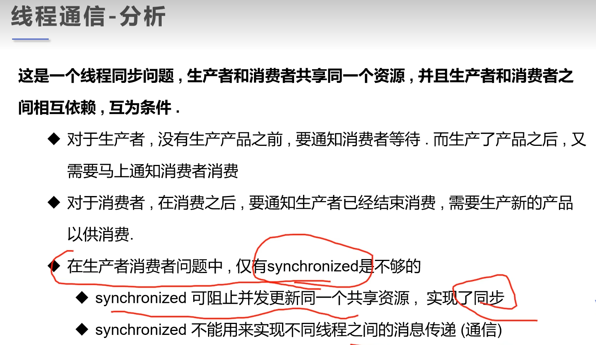

### 线程通信





### 生产者消费者模型 -> 利用缓冲区解决问题： 管程法

示例代码：

```java
package com.jsun.threads.communication;

public class ProducerConsumer {
    public static void main(String[] args) {
        ProductContainer container = new ProductContainer();
        new Producer(container).start();
        new Consumer(container).start();
    }
}

// 缓冲区
class ProductContainer {
    // 容器计数器
    int count = 0;
    // 创建并初始化容器
    Product[] products = new Product[10];

    // 生产者放入产品
    public synchronized void push(Product product) {
        // 如果容器满了，则需要等待消费者消费
        if (count == products.length) {
            // 通知消费者消费，生产者则等待。
            try {
                this.wait();
            } catch (InterruptedException e) {
                throw new RuntimeException(e);
            }
        }
        // 如如果容器没有满，则加入产品
        products[count] = product;
        count++;

        // 通知消费者去消费
        this.notifyAll();
    }

    // 消费者消费产品
    public synchronized Product pull() {
        // 判断能否消费
        if (count == 0) {
            // 等待生产者生产，消费者则等待
            try {
                this.wait();
            } catch (InterruptedException e) {
                throw new RuntimeException(e);
            }
        }

        // 如果可以消费
        count--;
        Product product = products[count];

        // 通知生产者生产
        this.notifyAll();
        return product;
    }

}

// 产品
class Product {
    int id;

    public Product(int id) {
        this.id = id;
    }
}

class Producer extends Thread {
    ProductContainer container;

    public Producer(ProductContainer container) {
        this.container = container;
    }

    @Override
    public void run() {
        for (int i = 0; i < 100; i++) {
            container.push(new Product(i));
            System.out.println("生产了" + i + "个产品");
            try {
                Thread.sleep(100);
            } catch (InterruptedException e) {
                throw new RuntimeException(e);
            }
        }
    }
}

class Consumer extends Thread {
    ProductContainer container;

    public Consumer(ProductContainer container) {
        this.container = container;
    }

    @Override
    public void run() {
        for (int i = 0; i < 100; i++) {
            System.out.println("消费了第" + container.pull().id + "个产品");
            try {
                Thread.sleep(100);
            } catch (InterruptedException e) {
                throw new RuntimeException(e);
            }
        }
    }
}
```

执行结果：

```html
"D:\Program Files\Java\jdk-17.0.2\bin\java.exe" "-javaagent:D:\Program Files\JetBrains\IntelliJ IDEA Community Edition 2025.1\lib\idea_rt.jar=50130" -Dfile.encoding=UTF-8 -classpath F:\workspace\multiple-threads\target\classes;C:\Users\Administrator\.m2\repository\commons-io\commons-io\2.18.0\commons-io-2.18.0.jar;C:\Users\Administrator\.m2\repository\org\projectlombok\lombok\1.18.30\lombok-1.18.30.jar com.jsun.threads.communication.ProducerConsumer
消费了第0个产品
生产了0个产品
生产了1个产品
消费了第1个产品
生产了2个产品
消费了第2个产品
消费了第3个产品
生产了3个产品
消费了第4个产品
生产了4个产品
生产了5个产品
消费了第5个产品
消费了第6个产品
生产了6个产品
消费了第7个产品
生产了7个产品
生产了8个产品
消费了第8个产品
消费了第9个产品
生产了9个产品
消费了第10个产品
生产了10个产品
生产了11个产品
消费了第11个产品
消费了第12个产品
生产了12个产品
生产了13个产品
消费了第13个产品
生产了14个产品
消费了第14个产品
消费了第15个产品
生产了15个产品
消费了第16个产品
生产了16个产品
消费了第17个产品
生产了17个产品
消费了第18个产品
生产了18个产品
生产了19个产品
消费了第19个产品
消费了第20个产品
生产了20个产品
消费了第21个产品
生产了21个产品
消费了第22个产品
生产了22个产品
生产了23个产品
消费了第23个产品
消费了第24个产品
生产了24个产品
生产了25个产品
消费了第25个产品
消费了第26个产品
生产了26个产品
生产了27个产品
消费了第27个产品
生产了28个产品
消费了第28个产品
生产了29个产品
消费了第29个产品
生产了30个产品
消费了第30个产品
生产了31个产品
消费了第31个产品
生产了32个产品
消费了第32个产品
生产了33个产品
消费了第33个产品
生产了34个产品
消费了第34个产品
生产了35个产品
消费了第35个产品
生产了36个产品
消费了第36个产品
生产了37个产品
消费了第37个产品
生产了38个产品
消费了第38个产品
生产了39个产品
消费了第39个产品
生产了40个产品
消费了第40个产品
生产了41个产品
消费了第41个产品
生产了42个产品
消费了第42个产品
生产了43个产品
消费了第43个产品
生产了44个产品
消费了第44个产品
生产了45个产品
消费了第45个产品
生产了46个产品
消费了第46个产品
生产了47个产品
消费了第47个产品
生产了48个产品
消费了第48个产品
生产了49个产品
消费了第49个产品
生产了50个产品
消费了第50个产品
...

Process finished with exit code 0

```

### 生产者消费者问题二： 信号灯法，使用标志位解决问题


示例代码：
```java
package com.jsun.threads.communication;

public class ProducerConsumerII {

    public static void main(String[] args) {
        Play play = new Play();
        new Actor(play)
                .start();
        new Audience(play)
                .start();
    }
}

// 生产者 -> 演员
class Actor extends Thread {

    Play play = new Play();

    public Actor(Play play) {
        this.play = play;
    }

    @Override
    public void run() {
        for (int i = 0; i < 20; i++) {
            if (i % 2 == 0) {
                this.play.play("动画片");
            } else {
                this.play.play("探索发现");
            }
        }
    }
}

// 消费者 -> 观众
class Audience extends Thread {
    Play play = new Play();

    public Audience(Play play) {
        this.play = play;
    }

    @Override
    public void run() {
        for (int i = 0; i < 20; i++) {
            this.play.watch();
        }
    }
}

// 产品 -> 节目
class Play {
    // 演员表演，观众等待 T
    // 观众观看，演员等待 F
    String movie;
    boolean flag = true;

    // 表演
    public synchronized void play(String movie) {
        if (!flag) {
            try {
                this.wait();
            } catch (InterruptedException e) {
                throw new RuntimeException(e);
            }
        }

        System.out.println("演员拍摄了" + movie);
        // 通知观众观看
        this.notifyAll();
        this.movie = movie;
        this.flag = !this.flag;
    }

    // 观看
    public synchronized void watch() {
        if (flag) {
            try {
                this.wait();
            } catch (InterruptedException e) {
                throw new RuntimeException(e);
            }
        }
        System.out.println("观众观看了" + movie);
        // 通知演员拍摄
        this.notifyAll();
        this.flag = !this.flag;
    }
}
```

执行结果：
```html
"D:\Program Files\Java\jdk-17.0.2\bin\java.exe" "-javaagent:D:\Program Files\JetBrains\IntelliJ IDEA Community Edition 2025.1\lib\idea_rt.jar=50308" -Dfile.encoding=UTF-8 -classpath F:\workspace\multiple-threads\target\classes;C:\Users\Administrator\.m2\repository\commons-io\commons-io\2.18.0\commons-io-2.18.0.jar;C:\Users\Administrator\.m2\repository\org\projectlombok\lombok\1.18.30\lombok-1.18.30.jar com.jsun.threads.communication.ProducerConsumerII
演员拍摄了动画片
观众观看了动画片
演员拍摄了探索发现
观众观看了探索发现
演员拍摄了动画片
观众观看了动画片
演员拍摄了探索发现
观众观看了探索发现
演员拍摄了动画片
观众观看了动画片
演员拍摄了探索发现
观众观看了探索发现
演员拍摄了动画片
观众观看了动画片
演员拍摄了探索发现
观众观看了探索发现
演员拍摄了动画片
观众观看了动画片
演员拍摄了探索发现
观众观看了探索发现
演员拍摄了动画片
观众观看了动画片
演员拍摄了探索发现
观众观看了探索发现
演员拍摄了动画片
观众观看了动画片
演员拍摄了探索发现
观众观看了探索发现
演员拍摄了动画片
观众观看了动画片
演员拍摄了探索发现
观众观看了探索发现
演员拍摄了动画片
观众观看了动画片
演员拍摄了探索发现
观众观看了探索发现
演员拍摄了动画片
观众观看了动画片
演员拍摄了探索发现
观众观看了探索发现

Process finished with exit code 0
```