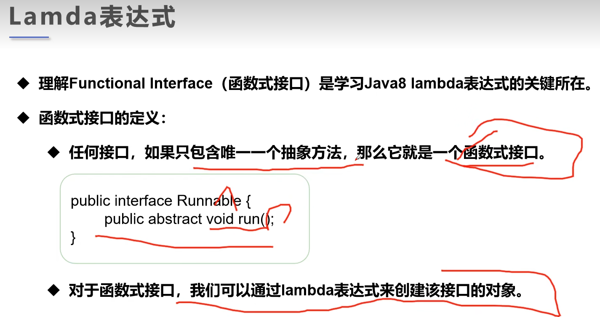

### Lambda Expression
#### 函数式接口定义：一个接口只含有唯一一个抽象方法。

示例代码：

```java
package com.jsun.threads.lambda;

public class TestLambda1 {

    public static void main(String[] args) {
        ILike like = new Like();
        like.lambda("HI");

        // 匿名内部类：没有类名称，必须借助接口或着父类。
        like = new ILike() {
            @Override
            public void lambda(String a) {
                System.out.println("这是个匿名内部类。" + a);
            }
        };
        like.lambda("Hello");

        // Lambda表达式：
        like = (a) -> {
            System.out.println("这是个Lambda表达式实现的函数式接口方法。" + a);
        };
        like.lambda("这个是接口方法的参数");
    }
}

interface ILike {
    void lambda(String a);
}

// 内部类：
class Like implements ILike {

    @Override
    public void lambda(String a) {
        System.out.println("I'm learning Lambda expression." + a);
    }
}
```
