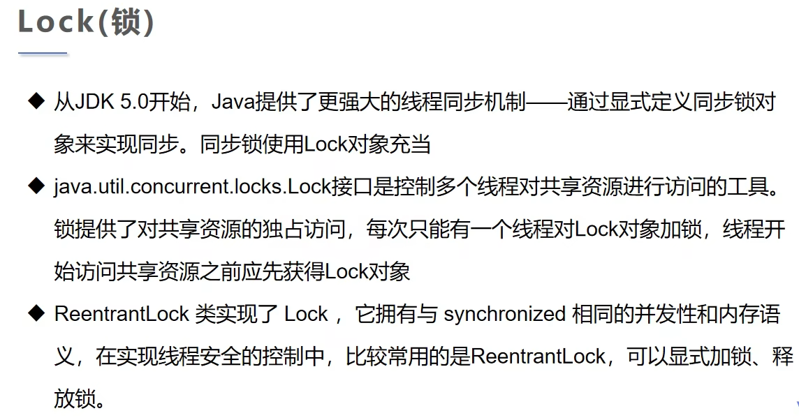
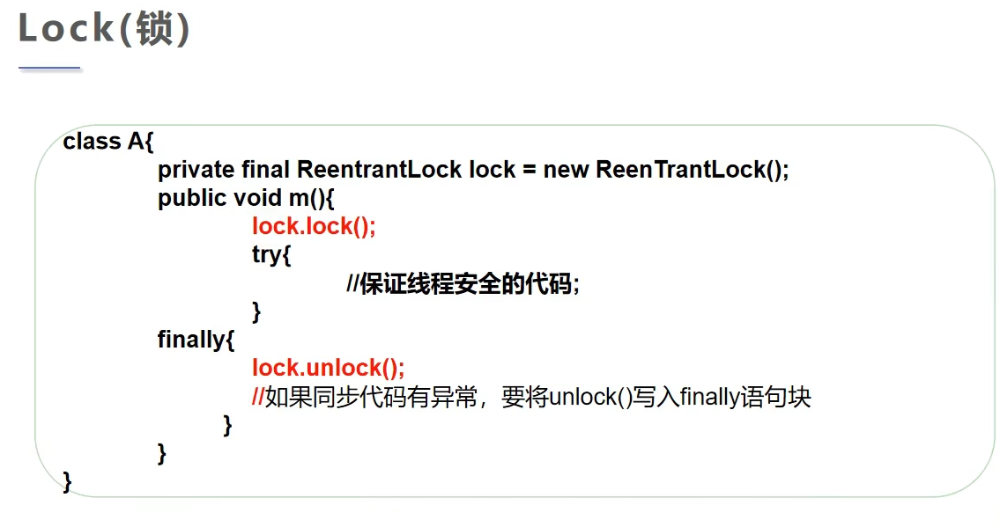

### 死锁


示例代码 - 死锁：
```java
package com.jsun.threads.lock;

/* 多个线程互相抱着对方需要的资源，然后行程僵持 */
public class DeadLock {
    public static void main(String[] args) {
        MakeUp girlA = new MakeUp(0, "白雪公主");
        MakeUp girlB = new MakeUp(1, "王子");
        girlA.start();
        girlB.start();
    }
}

class MakeUp extends Thread {
    // 需要的资源只有一份，用<static>关键字来保证！
    static Mirror mirror = new Mirror();
    static LipStick lipStick = new LipStick();
    // 选择
    int choices;
    // 需要化妆的人
    String herName;

    public MakeUp(int choices, String herName) {
        this.choices = choices;
        this.herName = herName;
    }

    @Override
    public void run() {
        try {
            makeup();
        } catch (InterruptedException e) {
            throw new RuntimeException(e);
        }
    }

    private void makeup() throws InterruptedException {
        if (choices == 0) {
            synchronized (lipStick) {
                System.out.println(this.herName + "获得口红的锁");
                Thread.sleep(1000);

                synchronized (mirror) {
                    System.out.println(this.herName + "获得镜子的锁");
                }
            }
        }

        synchronized (mirror) {
            System.out.println(this.herName + "获得镜子的锁");
            Thread.sleep(1000);

            synchronized (lipStick) {
                System.out.println(this.herName + "获得口红的锁");
            }
        }
    }

}

// 口红
class LipStick {

}

// 镜子
class Mirror {

}
```

执行结果：
```html
"D:\Program Files\Java\jdk-17.0.2\bin\java.exe" "-javaagent:D:\Program Files\JetBrains\IntelliJ IDEA Community Edition 2025.1\lib\idea_rt.jar=49236" -Dfile.encoding=UTF-8 -classpath F:\workspace\multiple-threads\target\classes;C:\Users\Administrator\.m2\repository\commons-io\commons-io\2.18.0\commons-io-2.18.0.jar;C:\Users\Administrator\.m2\repository\org\projectlombok\lombok\1.18.30\lombok-1.18.30.jar com.jsun.threads.lock.DeadLock
Lucy获得口红的锁
Jenny获得镜子的锁

Process finished with exit code 130
```

将同步代码块中的另一个同步块移至外面即可解决问题。
#### <踩过的坑：if语句中的else{}不能省略，不然结果异常！>
示例代码：
```java
package com.jsun.threads.lock;

/* 多个线程互相抱着对方需要的资源，然后行程僵持 */
public class DeadLock {
    public static void main(String[] args) {
        MakeUp girlA = new MakeUp(0, "白雪公主");
        MakeUp girlB = new MakeUp(1, "王子");
        girlA.start();
        girlB.start();
    }
}

class MakeUp extends Thread {
    // 需要的资源只有一份，用<static>关键字来保证！
    static Mirror mirror = new Mirror();
    static LipStick lipStick = new LipStick();
    // 选择
    int choices;
    // 需要化妆的人
    String herName;

    public MakeUp(int choices, String herName) {
        this.choices = choices;
        this.herName = herName;
    }

    @Override
    public void run() {
        try {
            makeup();
        } catch (InterruptedException e) {
            throw new RuntimeException(e);
        }
    }

    private void makeup() throws InterruptedException {
        if (choices == 0) {
            synchronized (lipStick) {
                System.out.println(this.herName + "获得口红的锁");
                Thread.sleep(1000);
            }
            synchronized (mirror) {
                System.out.println(this.herName + "获得镜子的锁");
            }
        } else {
            synchronized (mirror) {
                System.out.println(this.herName + "获得镜子的锁");
                Thread.sleep(2000);
            }
            synchronized (lipStick) {
                System.out.println(this.herName + "获得口红的锁");
            }
        }
    }

}

// 口红
class LipStick {

}

// 镜子
class Mirror {

}
```

执行结果：
```html
"D:\Program Files\Java\jdk-17.0.2\bin\java.exe" "-javaagent:D:\Program Files\JetBrains\IntelliJ IDEA Community Edition 2025.1\lib\idea_rt.jar=49381" -Dfile.encoding=UTF-8 -classpath F:\workspace\multiple-threads\target\classes;C:\Users\Administrator\.m2\repository\commons-io\commons-io\2.18.0\commons-io-2.18.0.jar;C:\Users\Administrator\.m2\repository\org\projectlombok\lombok\1.18.30\lombok-1.18.30.jar com.jsun.threads.lock.DeadLock
王子获得镜子的锁
白雪公主获得口红的锁
白雪公主获得镜子的锁
王子获得口红的锁

Process finished with exit code 0

```

### 避免死锁


### Lock

示例代码：
```java
package com.jsun.threads.lock;

import java.util.concurrent.locks.ReentrantLock;

public class TryLock {
    public static void main(String[] args) {
        Lock2 lock2 = new Lock2();
        new Thread(lock2).start();
        new Thread(lock2).start();
        new Thread(lock2).start();
    }
}

class Lock2 implements Runnable {
    int tickerNumbers = 10;
    // 定义lock
    ReentrantLock lock = new ReentrantLock();

    @Override
    public void run() {
        while (true) {
            try {
                // 显示加锁
                lock.lock();
                if (tickerNumbers > 0) {
                    try {
                        Thread.sleep(1000);
                    } catch (InterruptedException e) {
                        throw new RuntimeException(e);
                    }
                    System.out.println("买到第" + tickerNumbers-- + "张票");
                } else {
                    break;
                }
            } finally {
                // 解锁
                lock.unlock();
            }
        }
    }
}
```

执行结果：
```html
"D:\Program Files\Java\jdk-17.0.2\bin\java.exe" "-javaagent:D:\Program Files\JetBrains\IntelliJ IDEA Community Edition 2025.1\lib\idea_rt.jar=49789" -Dfile.encoding=UTF-8 -classpath F:\workspace\multiple-threads\target\classes;C:\Users\Administrator\.m2\repository\commons-io\commons-io\2.18.0\commons-io-2.18.0.jar;C:\Users\Administrator\.m2\repository\org\projectlombok\lombok\1.18.30\lombok-1.18.30.jar com.jsun.threads.lock.TryLock
买到第10张票
买到第9张票
买到第8张票
买到第7张票
买到第6张票
买到第5张票
买到第4张票
买到第3张票
买到第2张票
买到第1张票

Process finished with exit code 0
```


