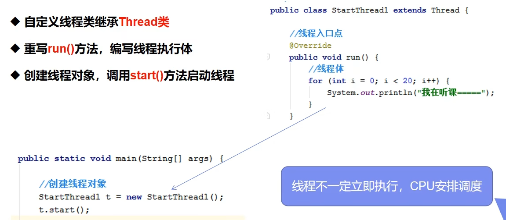
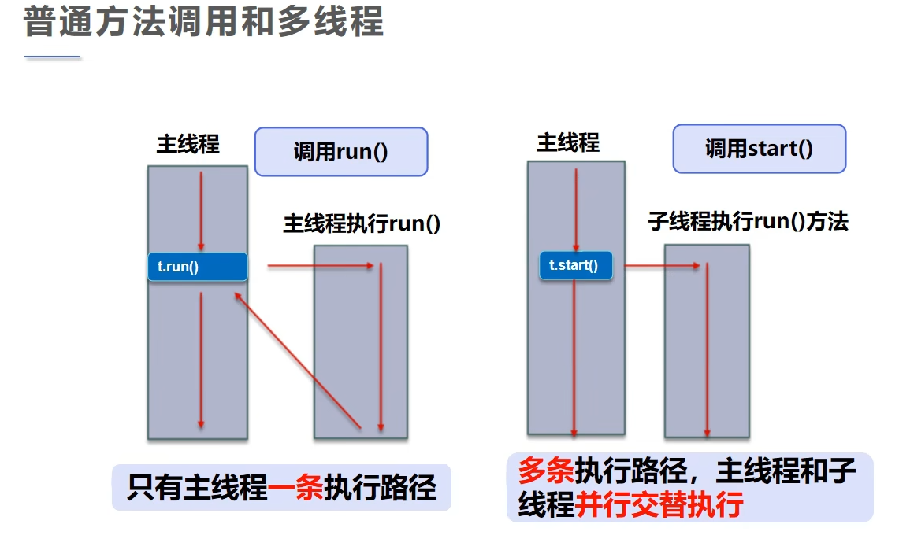
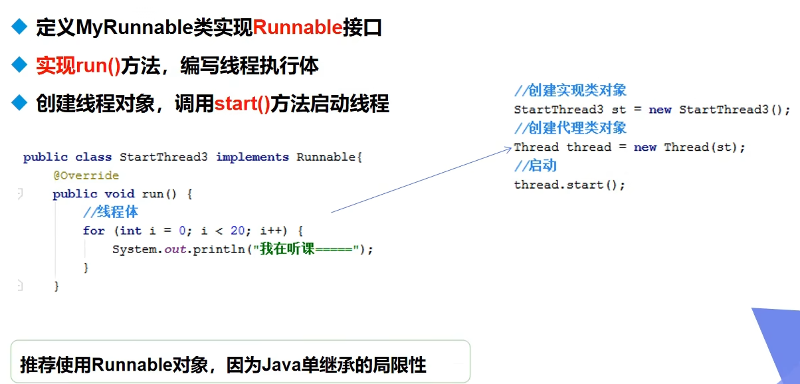
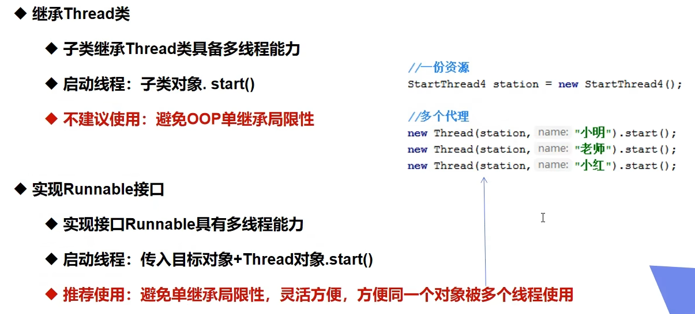
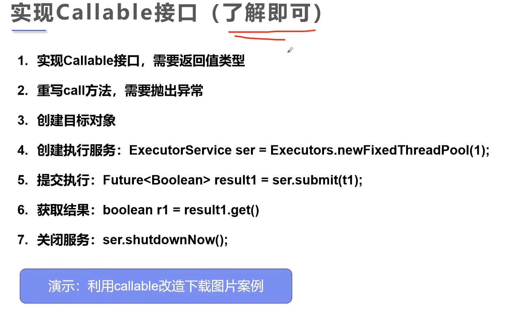

# 狂神说Java：多线程详解

### 02. 线程，进程，多线程

很多多线程是模拟出来的，真正的多线程指有多个CPU，即多核，如服务器。
模拟出来的多线程，即在一个CPU的情况下，因为切换的很快，所以有同时执行的错觉。

### 03. 继承Thread类

#### 创建线程方式1：继承Thread类，重写run()方法，调用start开启线程



示例代码：

```java
public class TestThread1 extends Thread {

    @Override
    public void run() {
        for (int i = 0; i < 10; i++) {
            System.out.println("This is another thread" + i);
        }
    }

    public static void main(String[] args) {
        TestThread1 testThread1 = new TestThread1();
        // 调用start()方法时，main()和run()方法同步执行
        testThread1.start();
        // 调用run()方法时，先执行run()方法，后执行main()方法。
//        testThread1.run();

        for (int i = 0; i < 1000; i++) {
            System.out.println("This is main thread" + i);
        }
    }
}
```

执行结果：

```markdown
"D:\Program Files\Java\jdk-17.0.2\bin\java.exe" "-javaagent:D:\Program Files\JetBrains\IntelliJ IDEA Community Edition
2025.1\lib\idea_rt.jar=60529" -Dfile.encoding=UTF-8 -classpath F:\workspace\multiple-threads\target\classes;C:
\Users\Administrator\.m2\repository\commons-io\commons-io\2.18.0\commons-io-2.18.0.jar
com.jsun.teacher.startthreads.TestThread1
This is main thread0
This is main thread1
This is main thread2
This is main thread3
...
This is main thread58
This is main thread59
This is main thread60
This is main thread61
This is main thread62
This is main thread63
This is another thread0
This is main thread64
This is main thread65
This is main thread66
This is main thread67
This is main thread68
...
This is main thread136
This is main thread137
This is main thread138
This is main thread139
This is main thread140
This is main thread141
This is main thread142
This is another thread1
This is another thread2
This is another thread3
This is another thread4
This is another thread5
This is another thread6
This is another thread7
This is another thread8
This is another thread9
This is main thread143
This is main thread144
This is main thread145
This is main thread146
This is main thread147
This is main thread148
This is main thread149
This is main thread150
```

由执行结果可以发现，线程不一定立即执行，由CPU调度安排！

示例代码：

```java
package com.jsun.threads.startthreads;

import org.apache.commons.io.FileUtils;

import java.io.File;
import java.io.IOException;
import java.net.URL;
import java.util.UUID;

public class TestThread2 extends Thread {
    private String url;
    private String name;

    public TestThread2(String url, String name) {
        this.url = url;
        this.name = name;
    }

    @Override
    public void run() {
        WebDownloader webDownloader = new WebDownloader();
        webDownloader.downloader(url, name);
        System.out.println("文件下载成功： " + name);
    }

    public static void main(String[] args) {
        TestThread2 t1 = new TestThread2("https://ts1.tc.mm.bing.net/th/id/R-C.4f2863129fa695e2d633efa69f66d24a?rik=HDCY2Zk1%2fYhp5Q&riu=http%3a%2f%2fimg95.699pic.com%2fphoto%2f40018%2f6447.jpg_wh860.jpg&ehk=jA0qDYe3MiCLDLo1h9MAZFrBxEuKpj%2f32eNNC2NwDTQ%3d&risl=&pid=ImgRaw&r=0", "src/main/resources/" + UUID.randomUUID() + "-01.jpg");
        TestThread2 t2 = new TestThread2("https://c-ssl.duitang.com/uploads/item/202006/15/20200615201826_mtJsX.jpeg", "src/main/resources/" + UUID.randomUUID() + "-02.jpg");
        TestThread2 t3 = new TestThread2("https://bpic.588ku.com/element_origin_min_pic/19/03/06/28f689f2bbb2e0e2fb10857d46385986.jpg", "src/main/resources/" + UUID.randomUUID() + "-03.jpg");

        t1.start();
        t2.start();
        t3.start();
    }
}

class WebDownloader {
    public void downloader(String url, String name) {
        try {
            FileUtils.copyURLToFile(new URL(url), new File(name));
        } catch (IOException e) {
            System.err.println("IO异常， downloader方法出现异常。");
        }
    }
}
```

执行结果：

```html
"D:\Program Files\Java\jdk-17.0.2\bin\java.exe" "-javaagent:D:\Program Files\JetBrains\IntelliJ IDEA Community Edition 2025.1\lib\idea_rt.jar=60082" -Dfile.encoding=UTF-8 -classpath F:\workspace\multiple-threads\target\classes;C:\Users\Administrator\.m2\repository\commons-io\commons-io\2.18.0\commons-io-2.18.0.jar com.jsun.teacher.startthreads.TestThread2
文件下载成功： src/main/resources/cffe6355-0c7c-4f6c-8995-37f95e20d00a-01.jpg
文件下载成功： src/main/resources/a2f8e5f2-ea31-4282-89f4-3ad09e0e3042-03.jpg
文件下载成功： src/main/resources/36f6cbd1-bab0-4019-a025-b417880f426b-02.jpg

Process finished with exit code 0
```

由执行结果可以发现，三个线程是同时执行的，并不会按照t1, t2, t3顺序执行。

### 实现Runnable接口

#### 创建线程方式2： 实现Runnable接口，重写run()方法，执行线程需要传入runnable接口的实现类，调用start()方法。



示例代码：

```java
package com.jsun.threads.startthreads;

public class TestThread3 implements Runnable {
    @Override
    public void run() {
        for (int i = 0; i < 10; i++) {
            System.out.println("This is another thread - " + i);
        }
    }

    public static void main(String[] args) {
        // 创建runnable接口的实现类对象
        TestThread3 testThread3 = new TestThread3();
        // 代理： 创建线程对象，通过线程对象来开启线程。
        new Thread(testThread3, "实现Runnable接口")
                .start();

        for (int i = 0; i < 100; i++) {
            System.out.println("This is main thread - " + i);
        }
    }
}

```

执行结果：

```html
"D:\Program Files\Java\jdk-17.0.2\bin\java.exe" "-javaagent:D:\Program Files\JetBrains\IntelliJ IDEA Community Edition 2025.1\lib\idea_rt.jar=61615" -Dfile.encoding=UTF-8 -classpath F:\workspace\multiple-threads\target\classes;C:\Users\Administrator\.m2\repository\commons-io\commons-io\2.18.0\commons-io-2.18.0.jar com.jsun.teacher.startthreads.TestThread3
This is main thread - 0
This is main thread - 1
This is main thread - 2
This is main thread - 3
This is main thread - 4
This is main thread - 5
This is main thread - 6
This is main thread - 7
This is main thread - 8
This is main thread - 9
This is main thread - 10
This is main thread - 11
This is main thread - 12
This is main thread - 13
This is main thread - 14
This is main thread - 15
This is main thread - 16
This is main thread - 17
This is another thread - 0
This is another thread - 1
This is main thread - 18
This is main thread - 19
This is main thread - 20
This is main thread - 21
This is main thread - 22
This is main thread - 23
This is main thread - 24
This is main thread - 25
This is main thread - 26
This is main thread - 27
This is main thread - 28
This is main thread - 29
This is main thread - 30
This is main thread - 31
This is another thread - 2
This is another thread - 3
This is main thread - 32
This is another thread - 4
This is main thread - 33
This is another thread - 5
This is main thread - 34
This is another thread - 6
This is main thread - 35
This is another thread - 7
This is main thread - 36
This is another thread - 8
This is main thread - 37
This is another thread - 9
This is main thread - 38
This is main thread - 39
This is main thread - 40
This is main thread - 41
This is main thread - 42
This is main thread - 43
This is main thread - 44
This is main thread - 45
```

#### 小结：

推荐使用Runnable接口，避免单继承的局限性，方便同一对象被多个线程调用。


### 多线程同时操作一个对象时的线程安全问题

示例代码：

```java
package com.jsun.threads.startthreads;

public class TestThread4 implements Runnable {
    private int ticketNumbers = 10;

    @Override
    public void run() {
        while (ticketNumbers > 0) {
            System.out.println(Thread.currentThread().getName() + " - 买到了第" + ticketNumbers-- + "张票");
            // 模拟延时：
            try {
                Thread.sleep(200);
            } catch (InterruptedException e) {
                throw new RuntimeException(e);
            }
        }
    }

    public static void main(String[] args) {
        TestThread4 testThread4 = new TestThread4();
        new Thread(testThread4, "T1").start();
        new Thread(testThread4, "T2").start();
        new Thread(testThread4, "T3").start();
    }
}

```

执行结果：

```html
"D:\Program Files\Java\jdk-17.0.2\bin\java.exe" "-javaagent:D:\Program Files\JetBrains\IntelliJ IDEA Community Edition 2025.1\lib\idea_rt.jar=62560" -Dfile.encoding=UTF-8 -classpath F:\workspace\multiple-threads\target\classes;C:\Users\Administrator\.m2\repository\commons-io\commons-io\2.18.0\commons-io-2.18.0.jar com.jsun.teacher.startthreads.TestThread4
T1 - 买到了第10张票
T2 - 买到了第9张票
T3 - 买到了第8张票
T3 - 买到了第6张票
T1 - 买到了第6张票
T2 - 买到了第7张票
T1 - 买到了第4张票
T2 - 买到了第5张票
T3 - 买到了第5张票
T1 - 买到了第3张票
T3 - 买到了第2张票
T2 - 买到了第1张票

Process finished with exit code 0
```

从执行结果中可以发现，多线程操作同一对象，不同线程买到了同一张票；线程不安全，数据紊乱。

#### 案例：龟兔赛跑


示例代码：

```java
package com.jsun.threads.startthreads;

public class TurtleRabbitRace implements Runnable {
    private String winner;

    @Override
    public void run() {
        for (int i = 1; i <= 100; i++) {
            // 模拟兔子休息, 每10米休息100毫秒
            if (Thread.currentThread().getName().equals("兔子") && i % 10 == 0) {
                try {
                    Thread.sleep(100);
                } catch (InterruptedException e) {
                    throw new RuntimeException(e);
                }
            }
            boolean flag = gameOver(i);
            if (flag) {
                break;
            }
            System.out.println(Thread.currentThread().getName() + "-> 跑了" + i + "米");
        }
    }

    public static void main(String[] args) {
        TurtleRabbitRace race = new TurtleRabbitRace();
        new Thread(race, "兔子").start();
        new Thread(race, "乌龟").start();
    }

    private boolean gameOver(int metter) {
        if (winner != null) {
            return true;
        }
        if (metter >= 100) {
            winner = Thread.currentThread().getName();
            System.out.println("Winner is " + winner);
            return true;
        }
        return false;
    }
}

```

执行结果：

```html
"D:\Program Files\Java\jdk-17.0.2\bin\java.exe" "-javaagent:D:\Program Files\JetBrains\IntelliJ IDEA Community Edition 2025.1\lib\idea_rt.jar=64933" -Dfile.encoding=UTF-8 -classpath F:\workspace\multiple-threads\target\classes;C:\Users\Administrator\.m2\repository\commons-io\commons-io\2.18.0\commons-io-2.18.0.jar com.jsun.teacher.startthreads.TurtleRabbitRace
乌龟-> 跑了1米
乌龟-> 跑了2米
乌龟-> 跑了3米
乌龟-> 跑了4米
乌龟-> 跑了5米
乌龟-> 跑了6米
乌龟-> 跑了7米
乌龟-> 跑了8米
...
乌龟-> 跑了35米
乌龟-> 跑了36米
乌龟-> 跑了37米
兔子-> 跑了1米
兔子-> 跑了2米
兔子-> 跑了3米
兔子-> 跑了4米
兔子-> 跑了5米
兔子-> 跑了6米
兔子-> 跑了7米
兔子-> 跑了8米
兔子-> 跑了9米
乌龟-> 跑了38米
乌龟-> 跑了39米
乌龟-> 跑了40米
乌龟-> 跑了41米
乌龟-> 跑了42米
乌龟-> 跑了43米
乌龟-> 跑了44米
乌龟-> 跑了45米
乌龟-> 跑了46米
乌龟-> 跑了47米
乌龟-> 跑了48米
乌龟-> 跑了49米
乌龟-> 跑了50米
...
乌龟-> 跑了98米
乌龟-> 跑了99米
Winner is 乌龟

Process finished with exit code 0

```

#### 创建线程方式3：实现callable接口

Callable的好处：

- 可以定义返回值
- 可以抛出异常

实现方式：


示例代码：

```java
package com.jsun.threads.startthreads;

import org.apache.commons.io.FileUtils;

import java.io.File;
import java.io.IOException;
import java.net.URL;
import java.util.UUID;
import java.util.concurrent.*;

public class TestCallable implements Callable<Boolean> {

    private String url;
    private String name;

    public TestCallable(String url, String name) {
        this.url = url;
        this.name = name;
    }

    @Override
    public Boolean call() {
        WebDownload webDownload = new WebDownload();
        webDownload.download(url, name);
        System.out.println("文件下载成功： " + name);
        return true;
    }

    public static void main(String[] args) throws ExecutionException, InterruptedException {
        TestCallable t1 = new TestCallable("https://ts1.tc.mm.bing.net/th/id/R-C.4f2863129fa695e2d633efa69f66d24a?rik=HDCY2Zk1%2fYhp5Q&riu=http%3a%2f%2fimg95.699pic.com%2fphoto%2f40018%2f6447.jpg_wh860.jpg&ehk=jA0qDYe3MiCLDLo1h9MAZFrBxEuKpj%2f32eNNC2NwDTQ%3d&risl=&pid=ImgRaw&r=0", "src/main/resources/" + UUID.randomUUID() + "-01.jpg");
        TestCallable t2 = new TestCallable("https://c-ssl.duitang.com/uploads/item/202006/15/20200615201826_mtJsX.jpeg", "src/main/resources/" + UUID.randomUUID() + "-02.jpg");
        TestCallable t3 = new TestCallable("https://bpic.588ku.com/element_origin_min_pic/19/03/06/28f689f2bbb2e0e2fb10857d46385986.jpg", "src/main/resources/" + UUID.randomUUID() + "-03.jpg");

        // 创建执行服务：
        ExecutorService service = Executors.newFixedThreadPool(3);
        // 提交执行：
        Future<Boolean> submit1 = service.submit(t1);
        Future<Boolean> submit2 = service.submit(t2);
        Future<Boolean> submit3 = service.submit(t3);
        // 获取结果：
        boolean result1 = submit1.get();
        boolean result2 = submit2.get();
        boolean result3 = submit3.get();
        // 关闭服务：
        service.shutdownNow();
    }
}

class WebDownload {
    public void download(String url, String name) {
        try {
            FileUtils.copyURLToFile(new URL(url), new File(name));
        } catch (IOException e) {
            System.err.println("IO异常， downloader方法出现异常。");
        }
    }
}
```

执行结果：

```html
"D:\Program Files\Java\jdk-17.0.2\bin\java.exe" "-javaagent:D:\Program Files\JetBrains\IntelliJ IDEA Community Edition 2025.1\lib\idea_rt.jar=49489" -Dfile.encoding=UTF-8 -classpath F:\workspace\multiple-threads\target\classes;C:\Users\Administrator\.m2\repository\commons-io\commons-io\2.18.0\commons-io-2.18.0.jar com.jsun.teacher.startthreads.TestCallable
文件下载成功： src/main/resources/f7fac83c-9751-4f99-b1af-a3bc3e10f876-02.jpg
文件下载成功： src/main/resources/4d4f5a04-1ab8-4f71-a2c0-8d3d18b34a2c-03.jpg
文件下载成功： src/main/resources/75a34857-a444-4155-b6a1-e3e3a91fc5e5-01.jpg

Process finished with exit code 0
```

#### 静态代理模式

示例代码：

```java
package com.jsun.threads.proxy;

public class StaticProxy {
    public static void main(String[] args) {
        // Thread类静态代理：
        new Thread(() -> System.out.println("对比Thread与静态代理"))
                .start();
        // 自己实现的静态代理
        new EducationInstruction(new Student())
                .doTest();
    }
}

interface HighSchoolTest {
    void doTest();
}

class Student implements HighSchoolTest {

    @Override
    public void doTest() {
        System.out.println("我要考试了，祝自己一切顺利");
    }
}

class EducationInstruction implements HighSchoolTest {

    private HighSchoolTest target;

    public EducationInstruction(HighSchoolTest target) {
        this.target = target;
    }


    @Override
    public void doTest() {
        before();
        this.target.doTest();
        after();
    }

    private void after() {
        System.out.println("Cheers, the test is over!!!");
    }

    private void before() {
        System.out.println("OMG, the test comes");
    }
}
```

总结：

- 真实对象和代理对象都要实现同一个接口
- 代理对象要代替真实对象

好处：

- 代理对象可以做很多真实对象做不到的事情
- 真实对象专注于做自己的事情