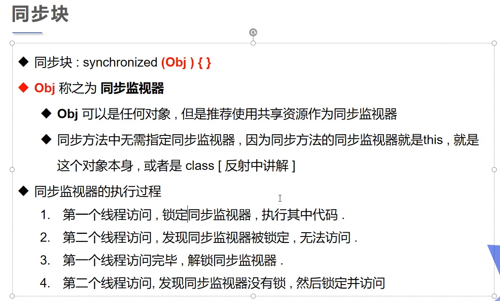

### 并发

#### 并发


#### 同步


#### 队列与所


#### 线程同步


<保证安全则会牺牲性能，反之亦然！>

### 不安全 - 买票

示例代码：

```java
package com.jsun.threads.synchronization;

/* 线程不安全 */
public class UnsafeTicketBooking {
    public static void main(String[] args) {
        TicketBooking ticketBooking = new TicketBooking();
        new Thread(ticketBooking, "aaa").start();
        new Thread(ticketBooking, "bbb").start();
        new Thread(ticketBooking, "ccc").start();
    }
}

class TicketBooking implements Runnable {
    int ticketNumbers = 10;
    // 停止线程标识
    boolean flag = true;

    @Override
    public void run() {
        while (true) {
            book();
        }
    }

    private void book() {
        // 判断是否邮票
        if (ticketNumbers <= 0) {
            flag = false;
            return;
        }
        try {
            Thread.sleep(100);
        } catch (InterruptedException e) {
            throw new RuntimeException(e);
        }
        System.out.println(Thread.currentThread().getName() + "买到" + ticketNumbers--);
    }
}
```

执行结果：

```html
"D:\Program Files\Java\jdk-17.0.2\bin\java.exe" "-javaagent:D:\Program Files\JetBrains\IntelliJ IDEA Community Edition 2025.1\lib\idea_rt.jar=64268" -Dfile.encoding=UTF-8 -classpath F:\workspace\multiple-threads\target\classes;C:\Users\Administrator\.m2\repository\commons-io\commons-io\2.18.0\commons-io-2.18.0.jar com.jsun.threads.synchronization.UnsafeTicketBooking
bbb买到9
ccc买到8
aaa买到10
ccc买到6
bbb买到5
aaa买到7
bbb买到4
aaa买到3
ccc买到3
bbb买到2
aaa买到1
ccc买到0
bbb买到-1

Process finished with exit code 130
```

### 不安全- 取钱

示例代码：

```java
package com.jsun.threads.synchronization;

import lombok.AllArgsConstructor;
import lombok.Data;

public class UnsafeCashing {
    public static void main(String[] args) {
        Account account = new Account("基金", 100);
        Drawing client = new Drawing(account, 50, "Client");
        Drawing clientSpouse = new Drawing(account, 80, "Client Spouse");
        client.start();
        clientSpouse.start();
    }
}

@AllArgsConstructor
class Drawing extends Thread {
    Account account;
    double drawingAmount;
    double cashing;

    public Drawing(Account account, double drawingAmount, String name) {
        super(name);
        this.account = account;
        this.drawingAmount = drawingAmount;
    }


    @Override
    public void run() {
        // 判断有没有钱
        if (account.balance - drawingAmount < 0) {
            System.out.println(Thread.currentThread().getName() + " - 余额不足");
            return;
        }

        // 模拟延时
        try {
            Thread.sleep(1000);
        } catch (InterruptedException e) {
            throw new RuntimeException(e);
        }
        // 更新卡里的余额
        account.balance -= drawingAmount;
        // 更新手里的现金
        cashing += drawingAmount;
        System.out.println(account.name + "余额为： " + account.balance);
        System.out.println(this.getName() + "现金为： " + cashing);
    }
}

@Data
@AllArgsConstructor
class Account {
    String name;
    double balance;
}
```

执行结果：

```html
"D:\Program Files\Java\jdk-17.0.2\bin\java.exe" "-javaagent:D:\Program Files\JetBrains\IntelliJ IDEA Community Edition 2025.1\lib\idea_rt.jar=64826" -Dfile.encoding=UTF-8 -classpath F:\workspace\multiple-threads\target\classes;C:\Users\Administrator\.m2\repository\commons-io\commons-io\2.18.0\commons-io-2.18.0.jar;C:\Users\Administrator\.m2\repository\org\projectlombok\lombok\1.18.30\lombok-1.18.30.jar com.jsun.threads.synchronization.UnsafeCashing
基金余额为： -30.0
基金余额为： -30.0
Client现金为： 50.0
Client Spouse现金为： 80.0

Process finished with exit code 0
```

### 不安全 - ArrayList

示例代码：

```java
package com.jsun.threads.synchronization;

import java.util.ArrayList;
import java.util.List;

public class UnsafeList {
    public static void main(String[] args) throws InterruptedException {
        List<String> list = new ArrayList<>();
        for (int i = 0; i < 5000; i++) {
            new Thread(() -> {
                list.add(Thread.currentThread().getName());
            }).start();
        }
        // 模拟延时
        Thread.sleep(3000);
        System.out.println("ArrayList 长度： " + list.size());
    }
}
```

执行结果：

```html
"D:\Program Files\Java\jdk-17.0.2\bin\java.exe" "-javaagent:D:\Program Files\JetBrains\IntelliJ IDEA Community Edition 2025.1\lib\idea_rt.jar=64901" -Dfile.encoding=UTF-8 -classpath F:\workspace\multiple-threads\target\classes;C:\Users\Administrator\.m2\repository\commons-io\commons-io\2.18.0\commons-io-2.18.0.jar;C:\Users\Administrator\.m2\repository\org\projectlombok\lombok\1.18.30\lombok-1.18.30.jar com.jsun.threads.synchronization.UnsafeList
ArrayList 长度： 4995

Process finished with exit code 0

```

ArrayList 长度小于5000是因为有多个线程同一时间更新了同一位置的值。

### 同步方法


示例代码：
```java
 /* synchronized 同步锁，所的对象是this - 即类本身！ */
private synchronized void book() {
    // 判断是否邮票
    if (ticketNumbers <= 0) {
        flag = false;
        return;
    }
    try {
        Thread.sleep(100);
    } catch (InterruptedException e) {
        throw new RuntimeException(e);
    }
    System.out.println(Thread.currentThread().getName() + "买到" + ticketNumbers--);
}
```

### 同步代码块


示例代码：
```java
package com.jsun.threads.synchronization;

import lombok.AllArgsConstructor;
import lombok.Data;

public class UnsafeCashing {
    public static void main(String[] args) {
        Account account = new Account("基金", 100);
        Drawing client = new Drawing(account, 50, "Client");
        Drawing clientSpouse = new Drawing(account, 80, "Client Spouse");
        client.start();
        clientSpouse.start();
    }
}

@AllArgsConstructor
class Drawing extends Thread {
    Account account;
    double drawingAmount;
    double cashing;

    public Drawing(Account account, double drawingAmount, String name) {
        super(name);
        this.account = account;
        this.drawingAmount = drawingAmount;
    }


    /*
        由于synchronized所的对象默认是this,
        而当前的this对象是Drawing，
        并不是Account，
        所以直接锁run()方法没用。
        此处可以可以选择同步代码块！
     */
    @Override
    public void run() {
        // 锁的对象就是变化的量（即：需要增、删、改的对象），当前变化的量是卡内的金额，因此要锁<卡>而非<银行>！
        /* 锁account对象，把代码块放入synchronized方法体即可解决问题。 */
        synchronized (account) {
            // 判断有没有钱
            if (account.balance - drawingAmount < 0) {
                System.out.println(Thread.currentThread().getName() + " - 余额不足");
                return;
            }

            // 模拟延时
            try {
                Thread.sleep(1000);
            } catch (InterruptedException e) {
                throw new RuntimeException(e);
            }
            // 更新卡里的余额
            account.balance -= drawingAmount;
            // 更新手里的现金
            cashing += drawingAmount;
            System.out.println(account.name + "余额为： " + account.balance);
            System.out.println(this.getName() + "现金为： " + cashing);
        }
    }
}

@Data
@AllArgsConstructor
class Account {
    String name;
    double balance;
}
```
执行结果：
```html
"D:\Program Files\Java\jdk-17.0.2\bin\java.exe" "-javaagent:D:\Program Files\JetBrains\IntelliJ IDEA Community Edition 2025.1\lib\idea_rt.jar=65121" -Dfile.encoding=UTF-8 -classpath F:\workspace\multiple-threads\target\classes;C:\Users\Administrator\.m2\repository\commons-io\commons-io\2.18.0\commons-io-2.18.0.jar;C:\Users\Administrator\.m2\repository\org\projectlombok\lombok\1.18.30\lombok-1.18.30.jar com.jsun.threads.synchronization.UnsafeCashing
基金余额为： 50.0
Client现金为： 50.0
Client Spouse - 余额不足

Process finished with exit code 0
```

示例代码二： 
```java
package com.jsun.threads.synchronization;

import java.util.ArrayList;
import java.util.List;

public class UnsafeList {
    public static void main(String[] args) throws InterruptedException {
        List<String> list = new ArrayList<>();
        for (int i = 0; i < 5000; i++) {
            new Thread(() -> {
                // 先锁住list，再操作！
                synchronized (list) {
                    list.add(Thread.currentThread().getName());
                }
            }).start();
        }
        // 模拟延时
        Thread.sleep(3000);
        System.out.println("ArrayList 长度： " + list.size());
    }
}
```

执行结果：
```html
"D:\Program Files\Java\jdk-17.0.2\bin\java.exe" "-javaagent:D:\Program Files\JetBrains\IntelliJ IDEA Community Edition 2025.1\lib\idea_rt.jar=65167" -Dfile.encoding=UTF-8 -classpath F:\workspace\multiple-threads\target\classes;C:\Users\Administrator\.m2\repository\commons-io\commons-io\2.18.0\commons-io-2.18.0.jar;C:\Users\Administrator\.m2\repository\org\projectlombok\lombok\1.18.30\lombok-1.18.30.jar com.jsun.threads.synchronization.UnsafeList
ArrayList 长度： 5000

Process finished with exit code 0
```

### 线程安全的列表 - CopyOnWriteArrayList
示例代码：
```java
package com.jsun.threads.synchronization;

import java.util.concurrent.CopyOnWriteArrayList;

// java.util.concurrent
public class TryJUC {
    public static void main(String[] args) throws InterruptedException {
        CopyOnWriteArrayList<String> list = new CopyOnWriteArrayList<>();
        for (int i = 0; i < 10000; i++) {
            new Thread(() -> {
                list.add(Thread.currentThread().getName());
            }).start();
        }

        Thread.sleep(3000);
        System.out.println("List长度： " + list.size());
    }
}
```
执行结果：
```html
"D:\Program Files\Java\jdk-17.0.2\bin\java.exe" "-javaagent:D:\Program Files\JetBrains\IntelliJ IDEA Community Edition 2025.1\lib\idea_rt.jar=65285" -Dfile.encoding=UTF-8 -classpath F:\workspace\multiple-threads\target\classes;C:\Users\Administrator\.m2\repository\commons-io\commons-io\2.18.0\commons-io-2.18.0.jar;C:\Users\Administrator\.m2\repository\org\projectlombok\lombok\1.18.30\lombok-1.18.30.jar com.jsun.threads.synchronization.TryJUC
List长度： 10000

Process finished with exit code 0
```


