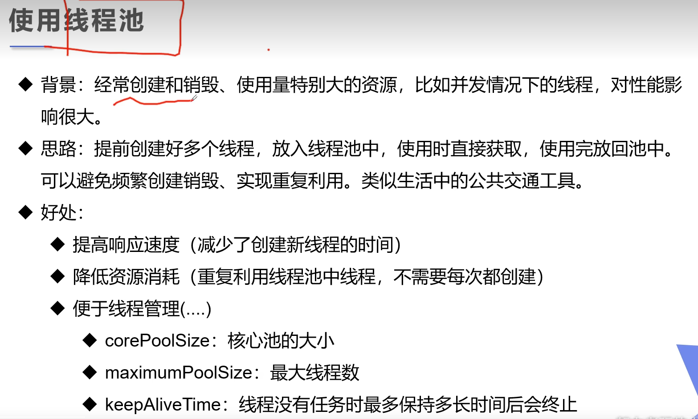
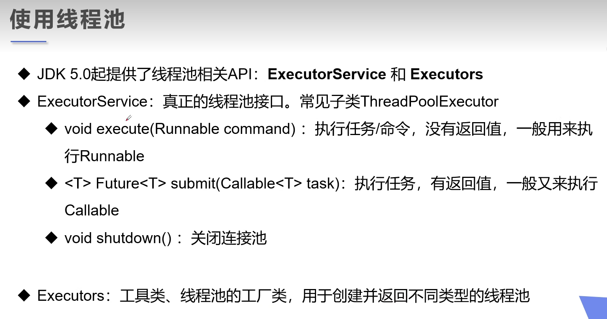

### 线程池



示例代码：
```java
package com.jsun.threads.pool;

import java.util.concurrent.ExecutorService;
import java.util.concurrent.Executors;

public class ThreadPool {
    public static void main(String[] args) {
        // 1. 创建服务， 创建线程池
        ExecutorService service = Executors.newFixedThreadPool(10);
        service.execute(new MyThread());
        service.execute(new MyThread());
        service.execute(new MyThread());
        service.execute(new MyThread());

        // 3. 关闭链接
        service.shutdown();
    }
}

class MyThread implements Runnable {
    @Override
    public void run() {
        System.out.println(Thread.currentThread().getName());
    }
}
```

执行结果：
```html
"D:\Program Files\Java\jdk-17.0.2\bin\java.exe" "-javaagent:D:\Program Files\JetBrains\IntelliJ IDEA Community Edition 2025.1\lib\idea_rt.jar=50417" -Dfile.encoding=UTF-8 -classpath F:\workspace\multiple-threads\target\classes;C:\Users\Administrator\.m2\repository\commons-io\commons-io\2.18.0\commons-io-2.18.0.jar;C:\Users\Administrator\.m2\repository\org\projectlombok\lombok\1.18.30\lombok-1.18.30.jar com.jsun.threads.pool.ThreadPool
pool-1-thread-2
pool-1-thread-1
pool-1-thread-3
pool-1-thread-4

Process finished with exit code 0
```