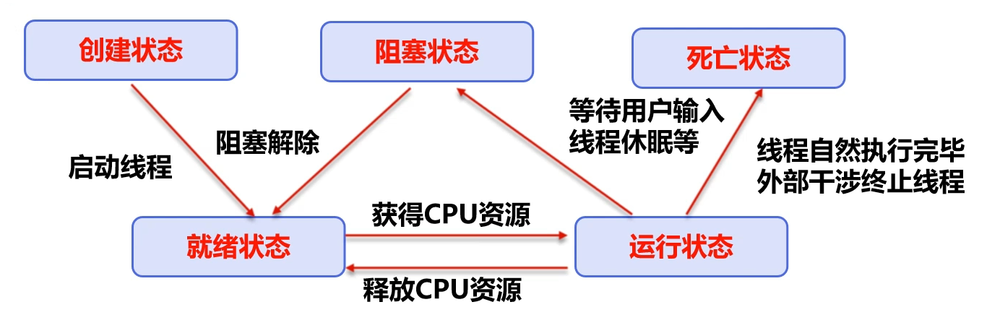
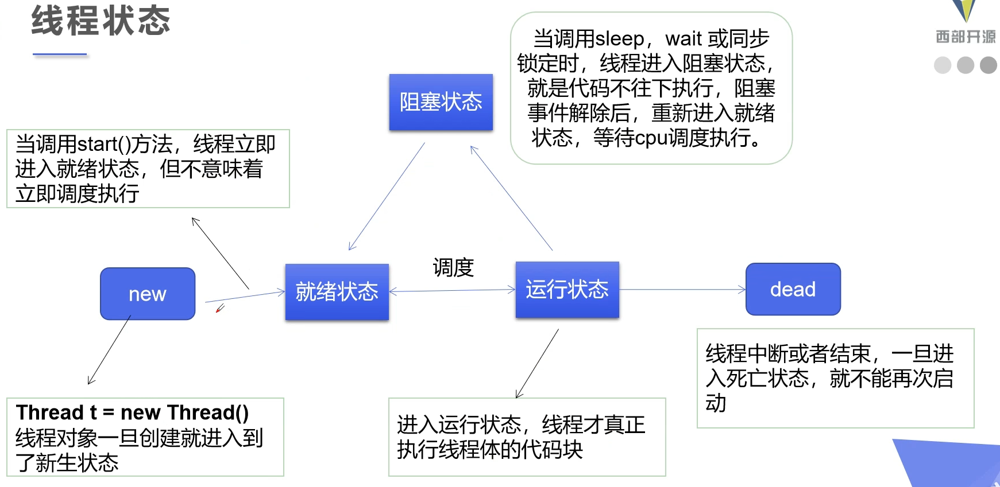
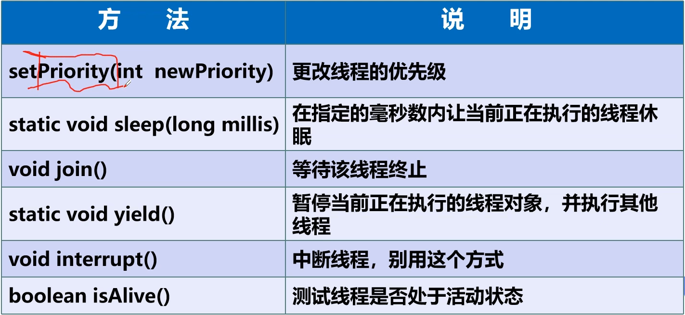
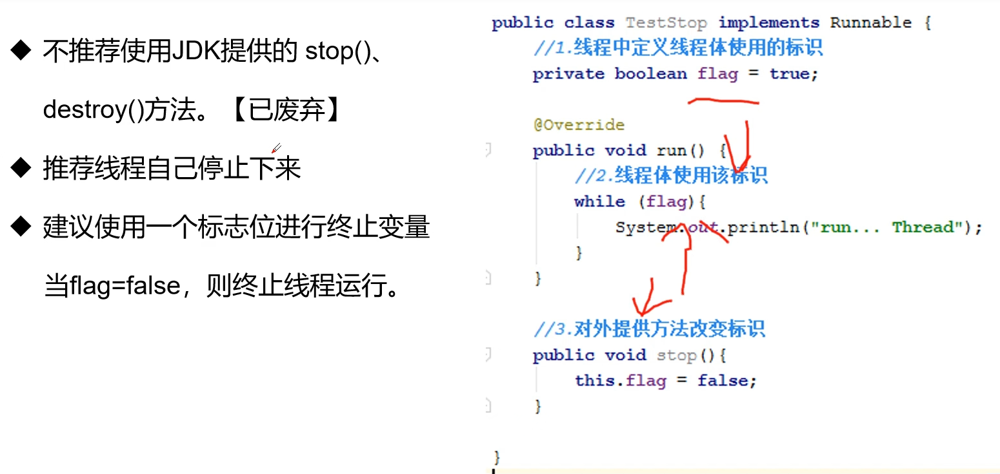
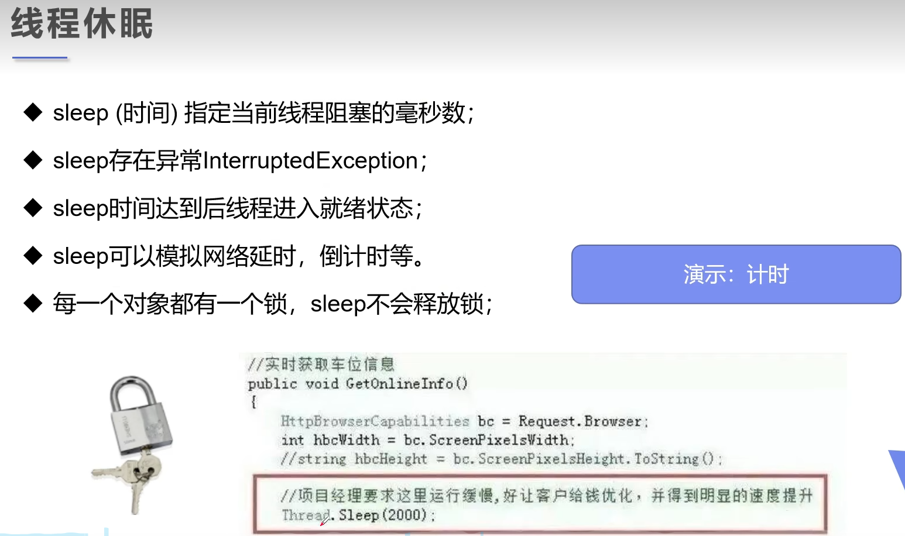
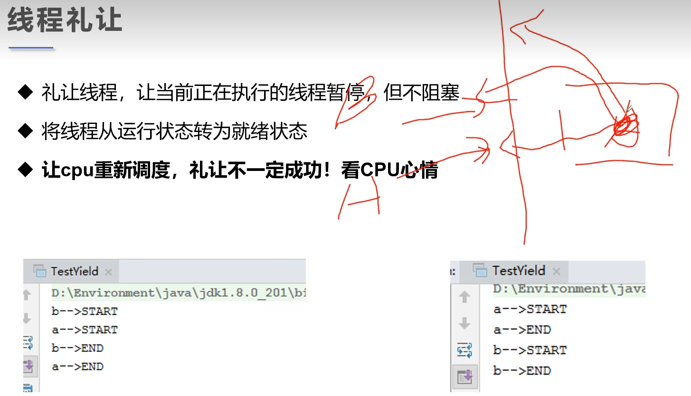
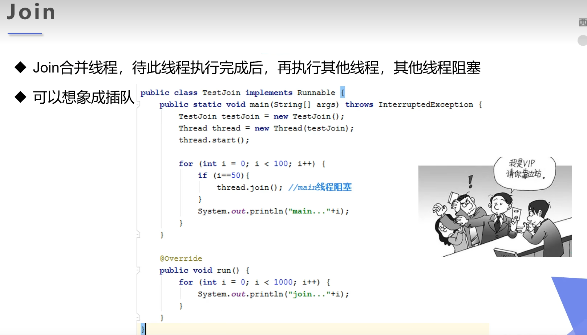
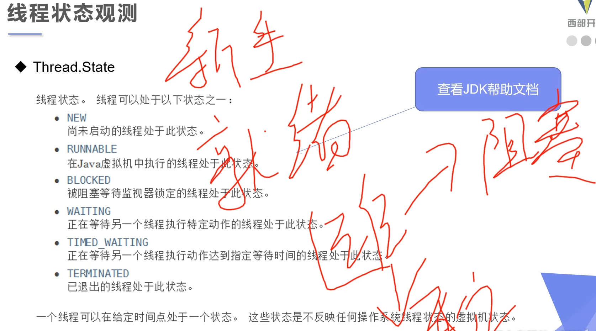
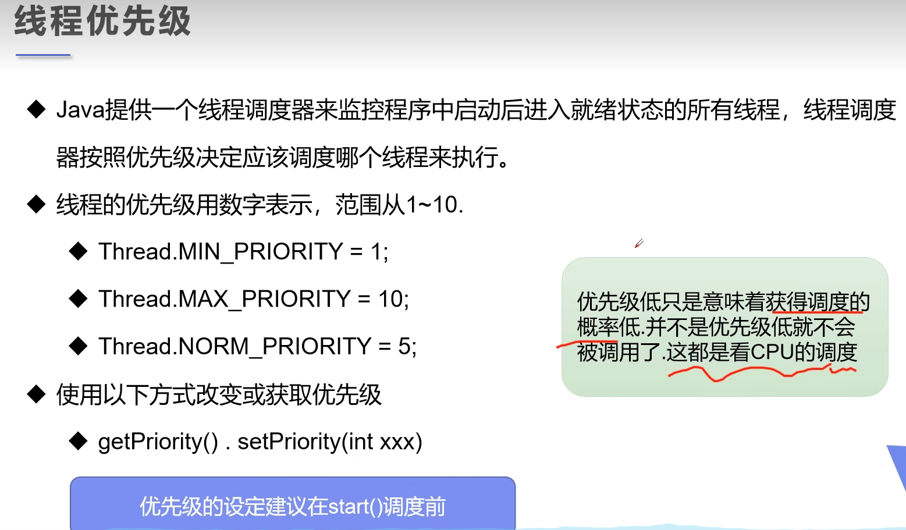

### 线程的五大状态







#### Stop

- 建议线程正常停止 -> 利用次数，不建议死循环。
- 建议使用标志位 -> 设置一个标志位
- 不要使用stop() or destory()等过时或者JDK不推荐的方法

示例代码：

```java
package com.jsun.threads.state;

public class StopThread implements Runnable {
    // 设置标志位
    private boolean flag = true;

    @Override
    public void run() {
        int i = 0;
        while (flag) {
            System.out.println("Run thread " + i++);
        }
    }

    // 设置一个公有方法停止线程，转换标志位。
    public void stop() {
        this.flag = false;
    }

    public static void main(String[] args) {
        StopThread stopThread = new StopThread();
        new Thread(stopThread).start();
        for (int i = 0; i < 1000; i++) {
            System.out.println("Main thread - i equals " + i);
            if (i == 500) {
                // 调用stop()方法切换标志位，让线程停止
                stopThread.stop();
                System.out.println("线程停止了");
            }
        }
    }
} 
```

#### Sleep



```java
public void run() {
    while (ticketNumbers > 0) {
        System.out.println(Thread.currentThread().getName() + " - 买到了第" + ticketNumbers-- + "张票");
        // 模拟延时：放大问题发生的概率
        try {
            Thread.sleep(200);
        } catch (InterruptedException e) {
            throw new RuntimeException(e);
        }
    }
}
```

#### Yield

例如：有A, B两个线程，目前CPU执行A线程，A线程想要礼让 -> A线程处于就绪状态； 此时的A，B同时处于就绪状态，有CPU统一调度，接下来每个线程都有可能被执行。


示例代码：

```java
package com.jsun.threads.state;

public class ThreadYield {
    public static void main(String[] args) {
        TryYield tryYield = new TryYield();
        new Thread(tryYield, "线程-A").start();
        new Thread(tryYield, "线程-B").start();
    }
}

class TryYield implements Runnable {
    @Override
    public void run() {
        System.out.println(Thread.currentThread().getName() + "线程开始执行");
        // 礼让
        Thread.yield();
        System.out.println(Thread.currentThread().getName() + "线程停止执行");
    }
}
```

#### Join


示例代码：

```java
package com.jsun.threads.state;

public class ThreadJoin implements Runnable {
    @Override
    public void run() {
        for (int i = 0; i < 500; i++) {
            System.out.println("我是VIP线程，所有人都要为我让路！");
        }
    }

    public static void main(String[] args) throws InterruptedException {
        // 自定义线程：
        ThreadJoin threadJoin = new ThreadJoin();
        Thread vipThread = new Thread(threadJoin);
        vipThread.start();

        // 主线程：
        for (int j = 0; j < 1000; j++) {
            if (j == 100) {
                // 强制插队
                vipThread.join();
            }
            System.out.println("我是文明排队的主线程，我执行了第" + j + "次");
        }
    }
}
```

执行结果：<! 和期待的不相符，待进一步调式排查>

```html
"D:\Program Files\Java\jdk-17.0.2\bin\java.exe" "-javaagent:D:\Program Files\JetBrains\IntelliJ IDEA Community Edition 2025.1\lib\idea_rt.jar=57663" -Dfile.encoding=UTF-8 -classpath F:\workspace\multiple-threads\target\classes;C:\Users\Administrator\.m2\repository\commons-io\commons-io\2.18.0\commons-io-2.18.0.jar com.jsun.teacher.state.ThreadJoin
我是VIP线程，所有人都要为我让路！
我是VIP线程，所有人都要为我让路！
我是文明排队的主线程，我执行了第0次
我是文明排队的主线程，我执行了第1次
我是文明排队的主线程，我执行了第2次
我是文明排队的主线程，我执行了第3次
我是文明排队的主线程，我执行了第4次
我是文明排队的主线程，我执行了第5次
我是文明排队的主线程，我执行了第6次
我是文明排队的主线程，我执行了第7次
我是文明排队的主线程，我执行了第8次
我是VIP线程，所有人都要为我让路！
我是文明排队的主线程，我执行了第9次
我是文明排队的主线程，我执行了第10次
我是文明排队的主线程，我执行了第11次
我是文明排队的主线程，我执行了第12次
...
我是文明排队的主线程，我执行了第32次
我是文明排队的主线程，我执行了第33次
我是文明排队的主线程，我执行了第34次
我是文明排队的主线程，我执行了第35次
我是VIP线程，所有人都要为我让路！
我是文明排队的主线程，我执行了第36次
我是文明排队的主线程，我执行了第37次
我是文明排队的主线程，我执行了第38次
我是文明排队的主线程，我执行了第39次
我是文明排队的主线程，我执行了第40次
我是文明排队的主线程，我执行了第41次
我是文明排队的主线程，我执行了第42次
我是文明排队的主线程，我执行了第43次
我是文明排队的主线程，我执行了第44次
我是文明排队的主线程，我执行了第45次
我是文明排队的主线程，我执行了第46次
我是文明排队的主线程，我执行了第47次
我是文明排队的主线程，我执行了第48次
我是VIP线程，所有人都要为我让路！
我是VIP线程，所有人都要为我让路！
我是VIP线程，所有人都要为我让路！
...
我是VIP线程，所有人都要为我让路！
我是VIP线程，所有人都要为我让路！
我是文明排队的主线程，我执行了第49次
我是文明排队的主线程，我执行了第50次
我是文明排队的主线程，我执行了第51次
我是文明排队的主线程，我执行了第52次
我是文明排队的主线程，我执行了第53次
我是文明排队的主线程，我执行了第54次
我是文明排队的主线程，我执行了第55次
我是VIP线程，所有人都要为我让路！
我是VIP线程，所有人都要为我让路！
我是VIP线程，所有人都要为我让路！
我是VIP线程，所有人都要为我让路！
我是VIP线程，所有人都要为我让路！
我是文明排队的主线程，我执行了第56次
我是文明排队的主线程，我执行了第57次
我是文明排队的主线程，我执行了第58次
...
我是文明排队的主线程，我执行了第97次
我是文明排队的主线程，我执行了第98次
我是文明排队的主线程，我执行了第99次
我是VIP线程，所有人都要为我让路！
我是VIP线程，所有人都要为我让路！
我是VIP线程，所有人都要为我让路！
...
我是VIP线程，所有人都要为我让路！
我是VIP线程，所有人都要为我让路！
我是文明排队的主线程，我执行了第100次
我是文明排队的主线程，我执行了第101次
我是文明排队的主线程，我执行了第102次
我是文明排队的主线程，我执行了第103次
我是文明排队的主线程，我执行了第104次
我是文明排队的主线程，我执行了第105次
我是文明排队的主线程，我执行了第106次
我是文明排队的主线程，我执行了第107次
我是文明排队的主线程，我执行了第108次
...

Process finished with exit code 0

```

#### 线程状态观察


示例代码：

```java
package com.jsun.threads.state;

import java.time.LocalTime;

public class ThreadMonitoring {
    public static void main(String[] args) throws InterruptedException {
        Thread thread = new Thread(() -> {
            for (int i = 0; i < 3; i++) {
                try {
                    Thread.sleep(1000);
                } catch (InterruptedException e) {
                    throw new RuntimeException(e);
                }
            }
            System.out.println("--------------------------");
        });

        // 观察状态
        Thread.State state = thread.getState();
        System.out.println("线程状态： " + state); // new

        // 观察启动后状态
        thread.start();
        state = thread.getState();
        System.out.println("线程状态： " + state); // running

        // 只要线程不终止， 就一直输出状态
        while (state != Thread.State.TERMINATED) {
            Thread.sleep(100);
            // 更新线程状态
            state = thread.getState();
            // 输出线程状态
            System.out.println("线程状态： " + LocalTime.now() + " - " + state);
        }
    }
}
```

执行结果：

```html
"D:\Program Files\Java\jdk-17.0.2\bin\java.exe" "-javaagent:D:\Program Files\JetBrains\IntelliJ IDEA Community Edition 2025.1\lib\idea_rt.jar=58481" -Dfile.encoding=UTF-8 -classpath F:\workspace\multiple-threads\target\classes;C:\Users\Administrator\.m2\repository\commons-io\commons-io\2.18.0\commons-io-2.18.0.jar com.jsun.teacher.state.ThreadMonitoring
线程状态： NEW
线程状态： RUNNABLE
线程状态： 16:10:52.885699500 - TIMED_WAITING
线程状态： 16:10:53.017348200 - TIMED_WAITING
线程状态： 16:10:53.127054200 - TIMED_WAITING
线程状态： 16:10:53.237755600 - TIMED_WAITING
线程状态： 16:10:53.347464200 - TIMED_WAITING
线程状态： 16:10:53.457173500 - TIMED_WAITING
线程状态： 16:10:53.566877 - TIMED_WAITING
线程状态： 16:10:53.677584500 - TIMED_WAITING
线程状态： 16:10:53.787291300 - TIMED_WAITING
线程状态： 16:10:53.897993800 - TIMED_WAITING
线程状态： 16:10:54.008696800 - TIMED_WAITING
线程状态： 16:10:54.117407300 - TIMED_WAITING
线程状态： 16:10:54.227113300 - TIMED_WAITING
线程状态： 16:10:54.337818600 - TIMED_WAITING
线程状态： 16:10:54.447525900 - TIMED_WAITING
线程状态： 16:10:54.557232 - TIMED_WAITING
线程状态： 16:10:54.666938500 - TIMED_WAITING
线程状态： 16:10:54.775647900 - TIMED_WAITING
线程状态： 16:10:54.885345 - TIMED_WAITING
线程状态： 16:10:54.992631400 - TIMED_WAITING
线程状态： 16:10:55.102549500 - TIMED_WAITING
线程状态： 16:10:55.212736800 - TIMED_WAITING
线程状态： 16:10:55.325398700 - TIMED_WAITING
线程状态： 16:10:55.433786800 - TIMED_WAITING
线程状态： 16:10:55.542572800 - TIMED_WAITING
线程状态： 16:10:55.650160200 - TIMED_WAITING
线程状态： 16:10:55.759733200 - TIMED_WAITING
--------------------------
线程状态： 16:10:55.868736 - TERMINATED

Process finished with exit code 0
```

#### 线程优先级

线程优先级高不一定先执行，只是概率搞了，由CPU调度执行。


示例代码：

```java
package com.jsun.threads.state;

public class ThreadPriority {
    public static void main(String[] args) {
        // 主线程默认优先级
        System.out.println(Thread.currentThread().getName() + "->" + Thread.currentThread().getPriority());
        TryPriority tryPriority = new TryPriority();
        Thread thread1 = new Thread(tryPriority);
        Thread thread2 = new Thread(tryPriority);
        Thread thread3 = new Thread(tryPriority);
        Thread thread4 = new Thread(tryPriority);
        Thread thread5 = new Thread(tryPriority);

        // 先设置优先级， 再启动
        thread1.start();

        thread2.setPriority(1);
        thread2.start();

        thread3.setPriority(3);
        thread3.start();

        thread4.setPriority(Thread.MAX_PRIORITY);
        thread4.start();

        thread5.setPriority(7);
        thread5.start();
    }
}

class TryPriority implements Runnable {

    @Override
    public void run() {
        // 自定义线程
        System.out.println(Thread.currentThread().getName() + "->" + Thread.currentThread().getPriority());
    }
}
```

执行结果：

```html
"D:\Program Files\Java\jdk-17.0.2\bin\java.exe" "-javaagent:D:\Program Files\JetBrains\IntelliJ IDEA Community Edition 2025.1\lib\idea_rt.jar=58723" -Dfile.encoding=UTF-8 -classpath F:\workspace\multiple-threads\target\classes;C:\Users\Administrator\.m2\repository\commons-io\commons-io\2.18.0\commons-io-2.18.0.jar com.jsun.threads.state.ThreadPriority
main->5
Thread-0->5
Thread-3->10
Thread-4->7
Thread-2->3
Thread-1->1

Process finished with exit code 0

```

#### 守护进程（Daemon）

示例代码：
```java

```
执行结果：
```html
"D:\Program Files\Java\jdk-17.0.2\bin\java.exe" "-javaagent:D:\Program Files\JetBrains\IntelliJ IDEA Community Edition 2025.1\lib\idea_rt.jar=59084" -Dfile.encoding=UTF-8 -classpath F:\workspace\multiple-threads\target\classes;C:\Users\Administrator\.m2\repository\commons-io\commons-io\2.18.0\commons-io-2.18.0.jar com.jsun.threads.state.ThreadDaemon
上帝保佑你每一天！
上帝保佑你每一天！
上帝保佑你每一天！
上帝保佑你每一天！
上帝保佑你每一天！
上帝保佑你每一天！
上帝保佑你每一天！
上帝保佑你每一天！
一年中的第300天
一年中的第301天
一年中的第302天
一年中的第303天
一年中的第304天
一年中的第305天
一年中的第306天
一年中的第307天
一年中的第308天
一年中的第309天
一年中的第310天
一年中的第311天
一年中的第312天
一年中的第313天
一年中的第314天
一年中的第315天
一年中的第316天
一年中的第317天
上帝保佑你每一天！
上帝保佑你每一天！
上帝保佑你每一天！
上帝保佑你每一天！
上帝保佑你每一天！
上帝保佑你每一天！
上帝保佑你每一天！
上帝保佑你每一天！
上帝保佑你每一天！
一年中的第1天
...
一年中的第319天
一年中的第320天
一年中的第321天
一年中的第322天
...
一年中的第361天
一年中的第362天
一年中的第363天
一年中的第364天
一年中的第365天
Current year is end!
上帝保佑你每一天！
上帝保佑你每一天！
上帝保佑你每一天！
上帝保佑你每一天！
上帝保佑你每一天！
上帝保佑你每一天！
上帝保佑你每一天！
上帝保佑你每一天！
上帝保佑你每一天！

Process finished with exit code 0

```