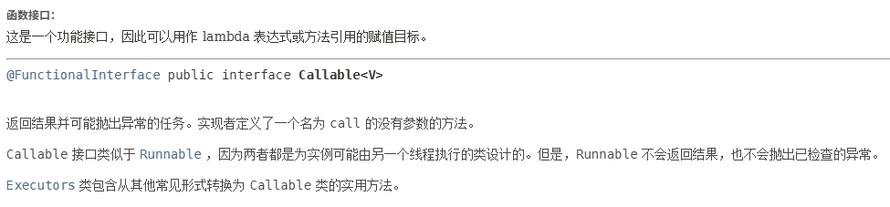
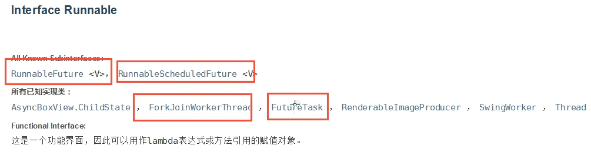
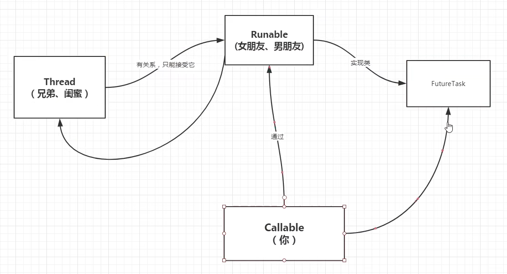
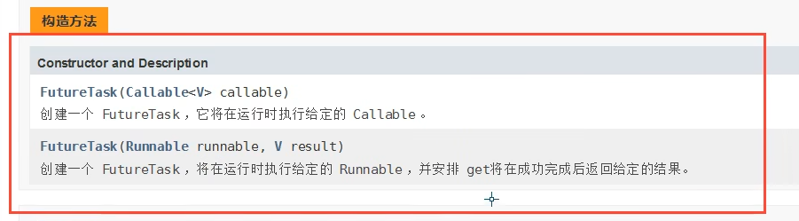

### Callable

知识点：

- 可以有返回值
- 可以抛出异常
- 有缓存
- get()结果可能需要等待，会阻塞






```java
// 获取Callable的返回结果. 注意： get()方法可能会产生阻塞，可以把他放在最后执行，或者使用异步通信。
String value = futureTask.get();
```
示例代码：
```java
package juc.concurrent.programming.callable;

import java.util.concurrent.Callable;
import java.util.concurrent.ExecutionException;
import java.util.concurrent.FutureTask;

public class CallableTest {
    public static void main(String[] args) {
        MyThread myThread = new MyThread();
        FutureTask<String> futureTask = new FutureTask<String>(myThread);

        new Thread(futureTask, "线程A").start();
        // 线程A的结果会被缓存，以提高效率；下面的代码不会在执行call（）方法。
        new Thread(futureTask, "线程B").start();
        try {
            // 获取Callable的返回结果. 注意： get()方法可能会产生阻塞，可以把他放在最后执行，或者使用异步通信。
            String value = futureTask.get();
            System.out.println("Callable 返回结果： " + value);
        } catch (InterruptedException e) {
            throw new RuntimeException(e);
        } catch (ExecutionException e) {
            throw new RuntimeException(e);
        }
    }
}

class MyThread implements Callable<String> {
    @Override
    public String call() throws Exception {
        System.out.println("call method");
        // 以下是耗时操作
        return "1024";
    }
}
```