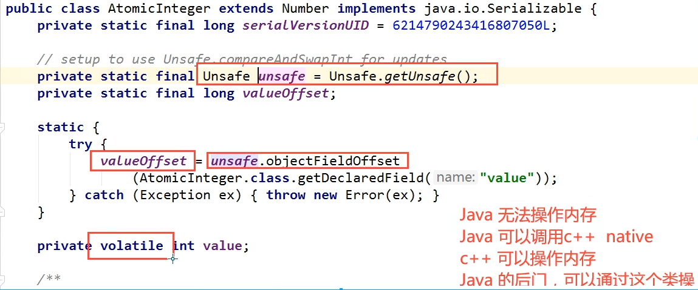
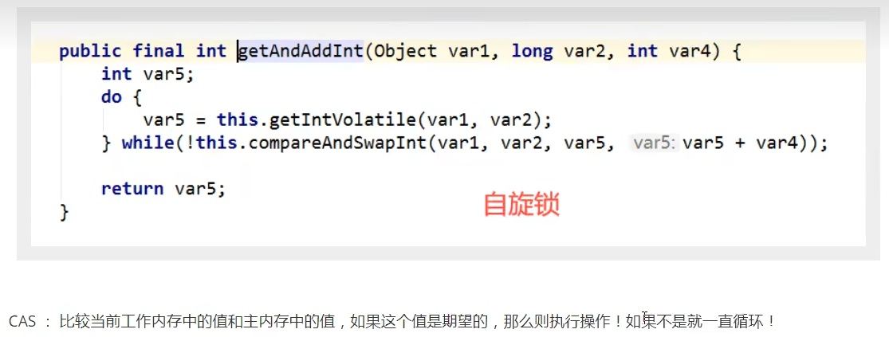

### 什么是CAS - compareAndSet： 比较并交换

示例代码：

```java
package juc.concurrent.programming.cas;

import java.util.concurrent.atomic.AtomicInteger;

public class CasDemo {
    public static void main(String[] args) {
        AtomicInteger atomicInteger = new AtomicInteger(2025);
        // public final boolean compareAndSet(int expectedValue, int newValue)
        /* 如果期望值达到了，就更新，否则不更新。*/
        atomicInteger.compareAndSet(2025, 2026);
        System.out.println(atomicInteger.get());
    }
}
```



**通过C++调用底层原生方法。内存操作，效率很高！**




#### 缺点

1. 底层自旋锁，循环耗时
2. 一次性只能保证一个共享变量的原子性
3. 存在ABA问题

### ABA问题

**什么是ABA问题：**
如图： 线程A拿到A = 1, 期待值为1，并将它修改为二；
然后线程B更快，它拿到A = 1, 将值修改为3之后又改回1。而这个过程线程A并不知情。


示例代码：

```java
package juc.concurrent.programming.cas;

import java.util.concurrent.atomic.AtomicInteger;

public class CasDemo {
    public static void main(String[] args) {
        AtomicInteger atomicInteger = new AtomicInteger(2025);
        // public final boolean compareAndSet(int expectedValue, int newValue)
        /* 如果期望值达到了，就更新，否则不更新。*/

        // 值被改修后又改回来
        atomicInteger.compareAndSet(2025, 2026);
        System.out.println(atomicInteger.get());
        atomicInteger.compareAndSet(2026, 2025);
        System.out.println(atomicInteger.get());

        atomicInteger.compareAndSet(2025, 1024);
        System.out.println(atomicInteger.get());

    }
}
```

### 如何解决ABA问题： 带版本号的原子操作


此时将AtomicStampedReference<Integer> atomicReference = new AtomicStampedReference<>(25, 1)
;初始值设置为超出复制范围的数字（如：2025）就会有这个问题。

示例代码：
```java
package juc.concurrent.programming.cas;

import java.util.concurrent.TimeUnit;
import java.util.concurrent.atomic.AtomicStampedReference;

// 乐观锁原理
public class CasDemo2 {
    public static void main(String[] args) {
        AtomicStampedReference<Integer> atomicReference = new AtomicStampedReference<>(25, 1);
        new Thread(() -> {
            // 获取版本号
            int stamp = atomicReference.getStamp();
            System.out.println("A1 - " + stamp);
            try {
                TimeUnit.SECONDS.sleep(2);
            } catch (InterruptedException e) {
                throw new RuntimeException(e);
            }

            System.out.println(atomicReference.compareAndSet(
                    25,
                    26,
                    atomicReference.getStamp(),
                    atomicReference.getStamp() + 1));
            System.out.println("A2 - " + atomicReference.getStamp());

            System.out.println(atomicReference.compareAndSet(
                    26,
                    25,
                    atomicReference.getStamp(),
                    atomicReference.getStamp() + 1));
            System.out.println("A3 - " + atomicReference.getStamp());
        }, "线程A").start();


        new Thread(() -> {
            int stamp = atomicReference.getStamp();
            System.out.println("B1 - " + stamp);

            try {
                TimeUnit.SECONDS.sleep(2);
            } catch (InterruptedException e) {
                throw new RuntimeException(e);
            }

            atomicReference.compareAndSet(25, 80, stamp, stamp + 1);
            System.out.println("B2 - " + atomicReference.getStamp());

        }, "线程B").start();
    }
}
```