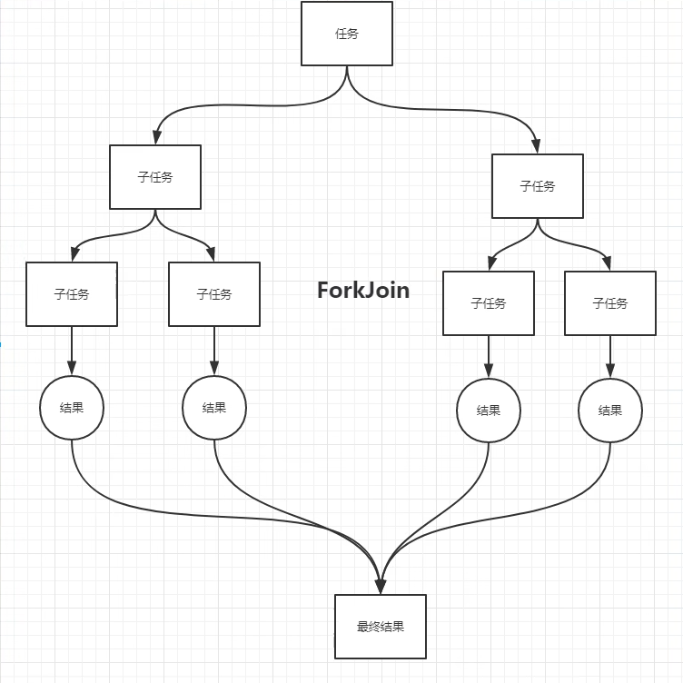
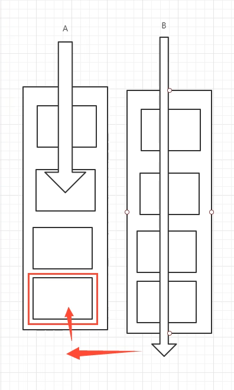
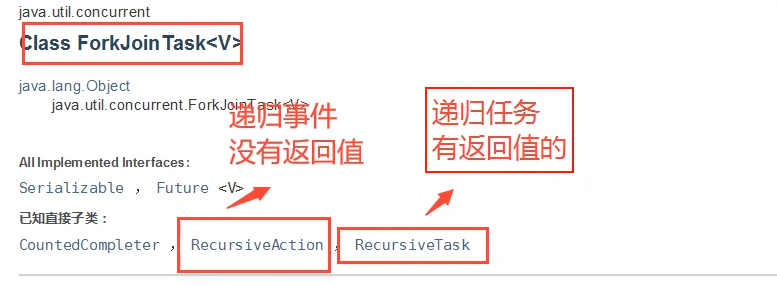

### ForkJoin

#### 使用场景： 大数据量计算

#### 一： 大任务拆分成小任务



#### 二： 工作窃取(不让线程等待 - 双端队列)：A,B两个线程同时执行任务，B线程执行完毕进而去执行A线程的任务。




示例代码：

```java
public static void main(String[] args) throws ExecutionException, InterruptedException {

    /* 可以通过中间值调优：*/
    // Sum: 499934463999828390; Time: 9825
    forkJoinTest();

    /* Stream 流式计算：并行执行，效率更高 */
    // Sum: 499999999500000000; Time: 487
    long start = System.currentTimeMillis();
    long sum = LongStream.range(0L, 10_0000_0000L).parallel().reduce(0, Long::sum);
    long end = System.currentTimeMillis();
    System.out.println("Sum: " + sum + "; Time: " + (end - start));
}
```