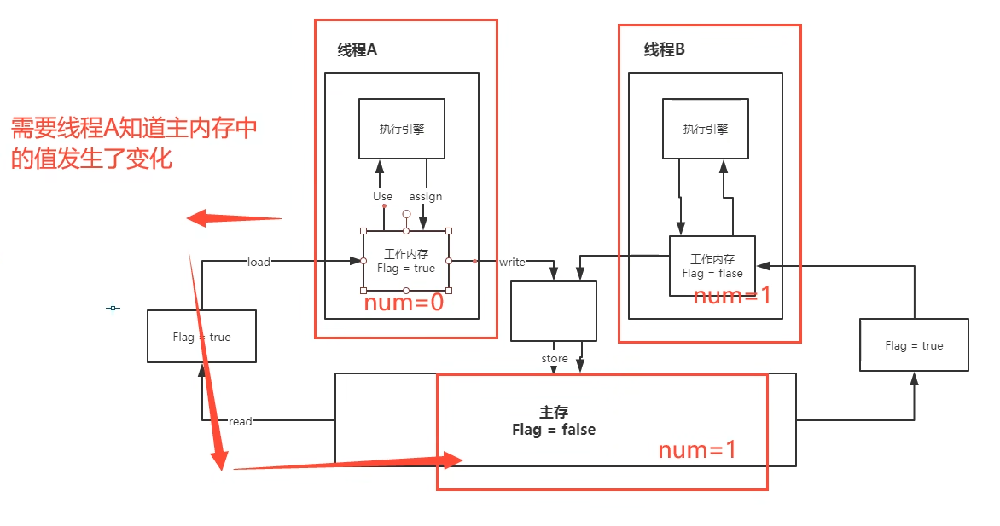
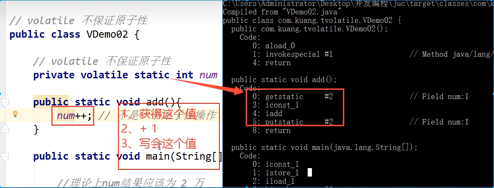

****# JMM - Java内存模型，它是一个概念，约定

### Volatile是Java虚拟机提供的轻量级同步机制，它可以：

1. 保证可见性
2. 不保证原子性
3. 禁止指令重排
   关于JMM的一些同步约定：

1. 线程解锁前，必须把共享变量`立刻`刷回主存；
2. 线程加锁前，必须读取主存中的最新值到工作内存中；
3. 加锁和解锁是同一把锁；

#### 8个基本操作：Java内存模型定义了以下八种操作来完成：

1. lock（锁定）：作用于主内存的变量，把一个变量标识为一条线程独占状态。
2. unlock（解锁）：作用于主内存变量，把一个处于锁定状态的变量释放出来，释放后的变量才可以被其他线程锁定。
3. read（读取）：作用于主内存变量，把一个变量值从主内存传输到线程的工作内存中，以便随后的load动作使用
4. load（载入）：作用于工作内存的变量，它把read操作从主内存中得到的变量值放入工作内存的变量副本中。
5. use（使用）：作用于工作内存的变量，把工作内存中的一个变量值传递给执行引擎，每当虚拟机遇到一个需要使用变量的值的字节码指令时将会执行这个操作。
6. assign（赋值）：作用于工作内存的变量，它把一个从执行引擎接收到的值赋值给工作内存的变量，每当虚拟机遇到一个给变量赋值的字节码指令时执行这个操作。
7. store（存储）：作用于工作内存的变量，把工作内存中的一个变量的值传送到主内存中，以便随后的write的操作。
8. write（写入）：作用于主内存的变量，它把store操作从工作内存中一个变量的值传送到主内存的变量中。

Java内存模型还规定了在执行上述八种基本操作时，必须满足如下规则：

如果要把一个变量从主内存中复制到工作内存，就需要按顺寻地执行read和load操作，
如果把变量从工作内存中同步回主内存中，就要按顺序地执行store和write操作。但Java内存模型只要求上述操作必须按顺序执行，而没有保证必须是连续执行。

- 不允许read和load、store和write操作之一单独出现
- 不允许一个线程丢弃它的最近assign的操作，即变量在工作内存中改变了之后必须同步到主内存中。
- 不允许一个线程无原因地（没有发生过任何assign操作）把数据从工作内存同步回主内存中。
- 一个新的变量只能在主内存中诞生，不允许在工作内存中直接使用一个未被初始化（load或assign）的变量。即就是对一个变量实施use和store操作之前，必须先执行过了assign和load操作。
- 一个变量在同一时刻只允许一条线程对其进行lock操作，但lock操作可以被同一条线程重复执行多次，多次执行lock后，只有执行相同次数的unlock操作，变量才会被解锁。lock和unlock必须成对出现
- 如果对一个变量执行lock操作，将会清空工作内存中此变量的值，在执行引擎使用这个变量前需要重新执行load或assign操作初始化变量的值
- 如果一个变量事先没有被lock操作锁定，则不允许对它执行unlock操作；也不允许去unlock一个被其他线程锁定的变量。
- 对一个变量执行unlock操作之前，必须先把此变量同步到主内存中（执行store和write操作）。

#### 问题： 程序不知道主存的值发生了变化



#### 解决方案： 使用volatile关键字修饰该值 - 保证可见性

示例代码：

```java
package juc.concurrent.programming.jmm;

import java.util.concurrent.TimeUnit;

public class JmmDemo {
    private volatile static int number = 0;

    public static void main(String[] args) throws InterruptedException {
        new Thread(() -> {
            while (number == 0) {
                // 让程序循环
            }
        }).start();

        TimeUnit.SECONDS.sleep(1);

        number = 1;
        System.out.println("Current number: " + number);
    }
}
```

#### 解决方案： 使用volatile关键字修饰该值 - 不保证原子性

原子性： 不可分割。线程A在执行任务的时候是不可以被打扰的，也不能被分割。要么同时成功，要么同时失败。


不加锁和Synchronized, 还可以使用原子类解决原子操作（AtomicInteger）, 它的底层是CAS操作，更高效！
这些类的底层都直接和操作系统挂钩，在内存中修改值。Unsaft类是一个很特殊的存在！

#### 解决方案： 使用volatile关键字修饰该值 - 禁止指令重排

- 指令重排 - 你写的程序，计算机并不是按照你写的那样子去执行的。
- `源代码` -> 编译器优化的重排 -> 指令并行也可能重排 -> 内存系统也会重排 -> `执行`
- ****

**volatile可以避免之类重排：内存屏障，CPU指令，它可以：**

- 保证特定的操作的执行顺序
- 可以保证某些变量的内存可见性 (单例模式)


