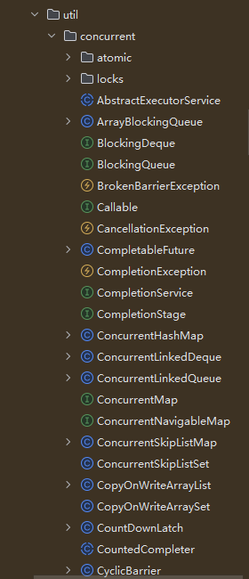
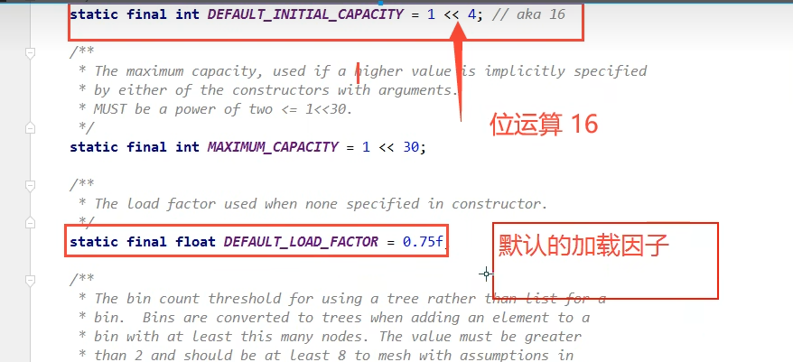

### 集合类不安全

#### List不安全, 并发操作会抛异常 （java.util.ConcurrentModificationException 并发修改异常）。



```java
public static void main(String[] args) {
    // 方案一： 转换成安全的list
    // List<String> list = Collections.synchronizedList(new ArrayList<>());
    // 方案二： 使用JUC包下的安全list替代
    List<String> list = new CopyOnWriteArrayList<>();

    for (int i = 1; i <= 100; i++) {
        new Thread(() -> {
            list.add(UUID.randomUUID().toString().substring(0, 5));
            System.out.println(list);
        }, String.valueOf(i)).start();
    }
}
```

CopyOnWrite - 写入时复制，写完插入，确保读写分离。 是计算机程序设计领域的一种优化策略。

多个线程调用的时候，写入可能被覆盖，通过CopyOnWrite避免覆盖而造成数据问题。

#### 同理对于Set

```java
Collections.synchronizedSet(new HashSet<>());
        new CopyOnWriteArraySet<>();
```

HashSet底层原理：

```java
    // HashSet底层实现
public HashSet() {
    map = new HashMap<>();
}

// add方法
public boolean add(E e) {
    return map.put(e, PRESENT) == null;
}

// Dummy value to associate with an Object in the backing Map
private static final Object PRESENT = new Object();
```

### Hashmap



```java
package juc.concurrent.programming.lists;

import java.util.HashMap;
import java.util.Map;
import java.util.UUID;
import java.util.concurrent.ConcurrentHashMap;

public class MapTest {
    public static void main(String[] args) {
        // Exception in thread "55" java.util.ConcurrentModificationException
        // Map<String, String> map = new HashMap<>();
        // 使用线程安全的Map： 
        Map<String, String> map = new ConcurrentHashMap<>();

        for (int i = 1; i <= 50; i++) {
            new Thread(() -> {
                map.put(Thread.currentThread().getName(), UUID.randomUUID().toString().substring(0, 5));
                System.out.println(map);
            }, String.valueOf(i)).start();
        }
    }
}
```