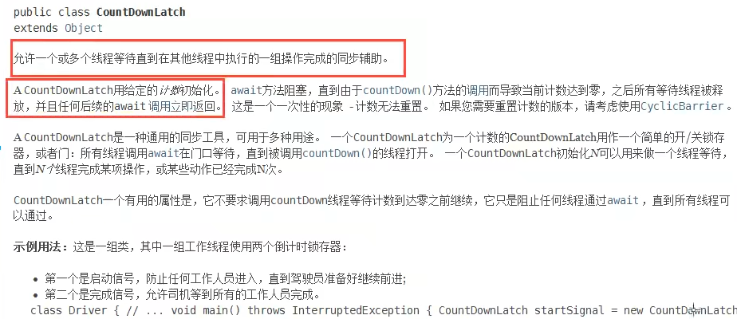
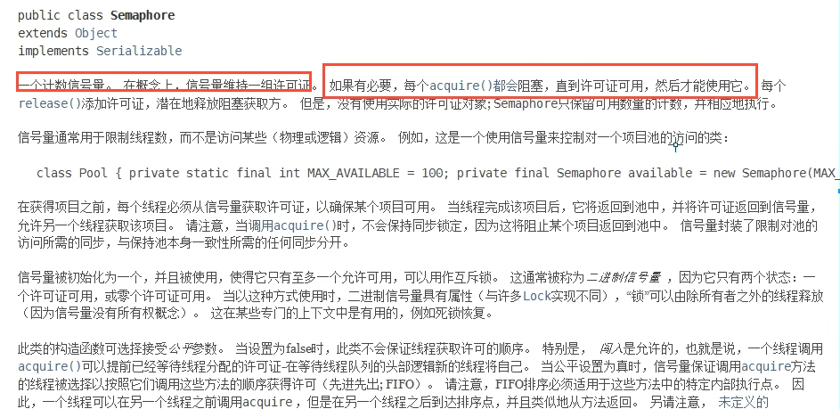

# 常用辅助类（必须掌握）

### CountDownLatch

#### 减法计数器 - 有必须要执行任务的时候使用.



示例代码：

```java
package juc.concurrent.programming.assissantclasses;

import java.util.concurrent.CountDownLatch;

public class CountDownLatchDemo {
    public static void main(String[] args) throws InterruptedException {
        // 总数是6，有必须要执行任务的时候使用！
        // 当前场景： 教室里面有6个学生，老师等所有人都走出教室后执行锁门操作。
        CountDownLatch countDownLatch = new CountDownLatch(6);

        for (int i = 1; i <= 6; i++) {
            new Thread(() -> {
                System.out.println(Thread.currentThread().getName() + " 走出教室");
                countDownLatch.countDown();
            }).start();
        }

        // 等待计数器归零，然后继续执行下面的代码
        countDownLatch.await();
        System.out.println("锁门");
    }
}
```

执行结果：

```html
"D:\Program Files\Java\jdk-17.0.2\bin\java.exe" "-javaagent:D:\Program Files\JetBrains\IntelliJ IDEA Community Edition 2025.1\lib\idea_rt.jar=60131" -Dfile.encoding=UTF-8 -classpath F:\workspace\multiple-threads\target\classes;C:\Users\Administrator\.m2\repository\commons-io\commons-io\2.18.0\commons-io-2.18.0.jar;C:\Users\Administrator\.m2\repository\org\projectlombok\lombok\1.18.30\lombok-1.18.30.jar juc.concurrent.programming.assissantclasses.CountDownLatchDemo
Thread-0 走出教室
Thread-1 走出教室
Thread-3 走出教室
Thread-2 走出教室
Thread-4 走出教室
Thread-5 走出教室
锁门

Process finished with exit code 0
```

#### 原理

- countDownLatch.countDown(); // 数量-1
- countDownLatch.await(); // 等待计数器归零，然后继续执行下面的代码
- 每次有线程调用countDown()数量减一，直到计数器变为零，此时的await()会被唤醒，继续执行！

### CyclicBarrier

加法计数器 - 允许一组线程全部等待彼此到达公共屏障点的同步辅助工具。 CyclicBarriers
在涉及必须偶尔相互等待的固定大小线程组的程序中很有用。屏障被称为cyclic，因为它可以在等待线程被释放后重新使用。
CyclicBarrier 支持可选的 Runnable 命令，该命令在每个障碍点运行一次，在派对中的最后一个线程到达之后，但在释放任何线程之前。这个
barrier action 对于在任何一方继续之前更新共享状态很有用。

示例代码：

```java
package juc.concurrent.programming.assissantclasses;

import java.util.concurrent.BrokenBarrierException;
import java.util.concurrent.CyclicBarrier;

public class CyclicBarrierDemo {
    public static void main(String[] args) {
        CyclicBarrier cyclicBarrier = new CyclicBarrier(7, () -> {
            System.out.println("成功召唤神龙");
        });

        for (int i = 1; i <= 7; i++) {
            // 补充知识点： 在Lambda表达式中，通过声明一个final类型的变量可以获取i的值。
            final int temp = i;
            new Thread(() -> {
                System.out.println(Thread.currentThread().getName() + "收集到了<" + temp + ">号龙珠");
                try {
                    // 等待计数器达到7
                    cyclicBarrier.await();
                } catch (InterruptedException e) {
                    throw new RuntimeException(e);
                } catch (BrokenBarrierException e) {
                    throw new RuntimeException(e);
                }
            }).start();
        }
    }

}
```

执行结果：

```html
"D:\Program Files\Java\jdk-17.0.2\bin\java.exe" "-javaagent:D:\Program Files\JetBrains\IntelliJ IDEA Community Edition 2025.1\lib\idea_rt.jar=60420" -Dfile.encoding=UTF-8 -classpath F:\workspace\multiple-threads\target\classes;C:\Users\Administrator\.m2\repository\commons-io\commons-io\2.18.0\commons-io-2.18.0.jar;C:\Users\Administrator\.m2\repository\org\projectlombok\lombok\1.18.30\lombok-1.18.30.jar juc.concurrent.programming.assissantclasses.CyclicBarrierDemo
Thread-4收集到了<5>号龙珠
Thread-3收集到了<4>号龙珠
Thread-1收集到了<2>号龙珠
Thread-5收集到了<6>号龙珠
Thread-2收集到了<3>号龙珠
Thread-0收集到了<1>号龙珠
Thread-6收集到了<7>号龙珠
成功召唤神龙

Process finished with exit code 0
```

### Semaphone

使用场景：

1. 多个共享资源互斥的场景
2. 并发限流，控制最大的并发数



#### 场景：抢车位【3个车位，6辆汽车】

- semaphore.acquire(): 获得锁。如果已经满了则等待释放
- semaphore.release()： 释放锁。会将当前的信号量+1，然后唤醒等待的线程
  示例代码：

```java
package juc.concurrent.programming.assissantclasses;

import java.util.concurrent.Semaphore;
import java.util.concurrent.TimeUnit;

public class SemaphoreDemo {
    public static void main(String[] args) {
        // 线程数量： 停车位数量
        Semaphore semaphore = new Semaphore(3);
        for (int i = 1; i <= 6; i++) {
            new Thread(() -> {
                try {
                    // 获得锁
                    semaphore.acquire();
                    System.out.println(Thread.currentThread().getName() + "获得车位");
                    // 模拟停车时间
                    TimeUnit.SECONDS.sleep(3);
                    System.out.println(Thread.currentThread().getName() + "离开车位");
                } catch (InterruptedException e) {
                    throw new RuntimeException(e);
                } finally {
                    semaphore.release();
                }
                System.out.println();
                // 释放锁

            }, String.valueOf(i)).start();
        }
    }
}
```

执行结果：

```html
"D:\Program Files\Java\jdk-17.0.2\bin\java.exe" "-javaagent:D:\Program Files\JetBrains\IntelliJ IDEA Community Edition 2025.1\lib\idea_rt.jar=60696" -Dfile.encoding=UTF-8 -classpath F:\workspace\multiple-threads\target\classes;C:\Users\Administrator\.m2\repository\commons-io\commons-io\2.18.0\commons-io-2.18.0.jar;C:\Users\Administrator\.m2\repository\org\projectlombok\lombok\1.18.30\lombok-1.18.30.jar juc.concurrent.programming.assissantclasses.SemaphoreDemo
3获得车位
2获得车位
1获得车位
3离开车位
1离开车位
4获得车位


5获得车位
2离开车位
6获得车位

5离开车位

4离开车位
6离开车位


Process finished with exit code 0

```