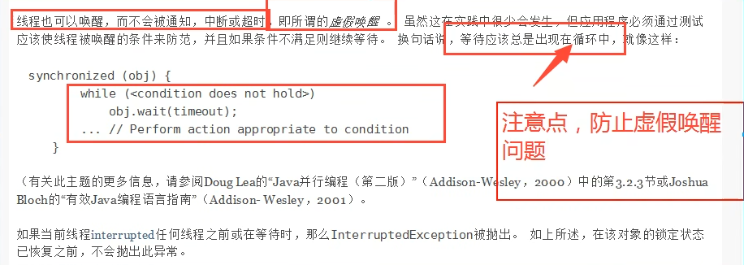
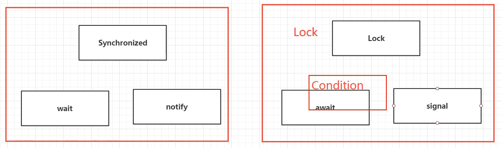

### 07. 传统的生产者和消费者问题，防止虚假唤醒。

#### 学习目标：

- 彻底搞定生产者消费者模式

#### 生产者消费者问题记住一下三步：

1. 判断等待
2. 执行业务（要做什么事情）
3. 通知其它线程

#### 插播面试必问问题：

1. 单例模式
2. 排序算法
3. 生产者消费者问题
4. 死锁

#### 虚假唤醒问题



#### 解决方案（来自官网文档）

Change:

```java
public synchronized void incremental() throws InterruptedException {
    // 判断等待
    if (counter != 0) {
        // 目前队列不为空，继续等待消费者消费
        this.wait();
    }
    // 执行业务
    counter++;
    System.out.println(Thread.currentThread().getName() + " -> " + counter);
    // 通知
    this.notifyAll();
}
```

To:

```java
public synchronized void incremental() throws InterruptedException {
    // 判断等待
    while (counter != 0) {
        // 目前队列不为空，继续等待消费者消费
        this.wait();
    }
    // 执行业务
    counter++;
    System.out.println(Thread.currentThread().getName() + " -> " + counter);
    // 通知
    this.notifyAll();
}
```

#### Synchronize锁 (wait(), notifyAll()) vs Lock锁 (Condition await(), signalAll())



示例代码： Synchronized

```java
package juc.concurrent.programming;

public class Zero7ProducerConsumer_Sync {
    public static void main(String[] args) {
        Data data = new Data();
        new Thread(() -> {
            try {
                for (int i = 0; i < 10; i++) {
                    data.incremental();
                }
            } catch (InterruptedException e) {
                throw new RuntimeException(e);
            }
        }, "Customized thread - A").start();
        new Thread(() -> {
            try {
                for (int i = 0; i < 10; i++) {
                    data.decremental();
                }
            } catch (InterruptedException e) {
                throw new RuntimeException(e);
            }
        }, "Customized thread - B").start();
        new Thread(() -> {
            try {
                for (int i = 0; i < 10; i++) {
                    data.incremental();
                }
            } catch (InterruptedException e) {
                throw new RuntimeException(e);
            }
        }, "Customized thread - C").start();
        new Thread(() -> {
            try {
                for (int i = 0; i < 10; i++) {
                    data.decremental();
                }
            } catch (InterruptedException e) {
                throw new RuntimeException(e);
            }
        }, "Customized thread - D").start();
    }
}

class Data {
    private int counter = 0;

    public synchronized void incremental() throws InterruptedException {
        // 判断等待
        while (counter != 0) {
            // 目前队列不为空，继续等待消费者消费
            this.wait();
        }
        // 执行业务
        counter++;
        System.out.println(Thread.currentThread().getName() + " -> " + counter);
        // 通知
        this.notifyAll();
    }

    public synchronized void decremental() throws InterruptedException {
        // 判断等待
        while (counter == 0) {
            // 目前队列为空，等待生产者生产
            this.wait();
        }
        // 执行业务
        counter--;
        System.out.println(Thread.currentThread().getName() + " -> " + counter);
        // 通知
        this.notifyAll();
    }
}
```

示例代码： Lock

```java
package juc.concurrent.programming;

import java.util.concurrent.locks.Condition;
import java.util.concurrent.locks.Lock;
import java.util.concurrent.locks.ReentrantLock;

public class Zero7ProducerConsumer_Lock {
    public static void main(String[] args) throws InterruptedException {
        NewData newData = new NewData();

        new Thread(() -> {
            try {
                for (int i = 0; i < 10; i++) {
                    newData.incremental();
                }
            } catch (InterruptedException e) {
                throw new RuntimeException(e);
            }
        }, "A").start();
        new Thread(() -> {
            try {
                for (int i = 0; i < 10; i++) {
                    newData.decremental();
                }
            } catch (InterruptedException e) {
                throw new RuntimeException(e);
            }
        }, "B").start();
        new Thread(() -> {
            try {
                for (int i = 0; i < 10; i++) {
                    newData.incremental();
                }
            } catch (InterruptedException e) {
                throw new RuntimeException(e);
            }
        }, "C").start();
        new Thread(() -> {
            try {
                for (int i = 0; i < 10; i++) {
                    newData.decremental();
                }
            } catch (InterruptedException e) {
                throw new RuntimeException(e);
            }
        }, "D").start();
    }
}

class NewData {
    Lock lock = new ReentrantLock();
    Condition condition = lock.newCondition();
    private int counter = 0;

    public void incremental() throws InterruptedException {
        lock.lock();
        try {
            /* 业务代码 */
            // 判断等待
            while (counter != 0) {
                // 目前队列不为空，继续等待消费者消费
                condition.await();
            }
            // 执行业务
            counter++;
            System.out.println(Thread.currentThread().getName() + " -> " + counter);
            // 通知
            condition.signalAll();
            /* 结束业务代码 */
        } finally {
            lock.unlock();
        }
    }

    public void decremental() throws InterruptedException {
        lock.lock();
        try {
            /* 业务代码 */
            // 判断等待
            while (counter == 0) {
                // 目前队列为空，等待生产者生产
                condition.await();
            }
            // 执行业务
            counter--;
            System.out.println(Thread.currentThread().getName() + " -> " + counter);
            // 通知
            condition.signalAll();
            /* 结束业务代码 */
        } finally {
            lock.unlock();
        }
    }
}
```

#### Condition 精准的通知和唤醒线程

例如：<生产线> 下单->支付->交易->物流

示例代码：

```java
package juc.concurrent.programming;

import java.util.concurrent.locks.Condition;
import java.util.concurrent.locks.Lock;
import java.util.concurrent.locks.ReentrantLock;

public class Zero7ProducerConsumer3 {
    public static void main(String[] args) {
        Data3 data3 = new Data3();
        // 需求： A执行完通知B； B执行完通知C；
        new Thread(() -> {
            for (int i = 0; i < 10; i++) {
                data3.printA();
            }
        }, "A").start();

        new Thread(() -> {
            for (int i = 0; i < 10; i++) {
                data3.printB();
            }
        }, "B").start();

        new Thread(() -> {
            for (int i = 0; i < 10; i++) {
                data3.printC();
            }
        }, "C").start();
    }
}

/* 资源类 */
class Data3 {
    Lock lock = new ReentrantLock();
    Condition condition1 = lock.newCondition();
    Condition condition2 = lock.newCondition();
    Condition condition3 = lock.newCondition();
    /*
     * 1 - A执行
     * 2 - B执行
     * 3 - C执行
     * */
    // 根据程序设定，初始值必须是1，2或3，否则程序将进入await().
    private int number = 1;

    public void printA() {
        lock.lock();
        try {
            // 业务代码： 判断；执行；通知。
            while (number != 1) {
                condition1.await();
            }
            System.out.println(Thread.currentThread().getName() + " - A");
            // 唤醒B
            number = 2;
            condition2.signal();
        } catch (Exception e) {
            e.printStackTrace();
        } finally {
            lock.unlock();
        }
    }

    public void printB() {
        lock.lock();
        try {
            // 业务代码： 判断；执行；通知。
            while (number != 2) {
                condition2.await();
            }
            System.out.println(Thread.currentThread().getName() + " - B");
            // 唤醒C
            number = 3;
            condition3.signal();
        } catch (Exception e) {
            e.printStackTrace();
        } finally {
            lock.unlock();
        }
    }

    public void printC() {

        lock.lock();
        try {
            // 业务代码： 判断；执行；通知。
            while (number != 3) {
                condition3.await();
            }
            System.out.println(Thread.currentThread().getName() + " - C");
            // 唤醒A
            number = 1;
            condition1.signal();
        } catch (Exception e) {
            e.printStackTrace();
        } finally {
            lock.unlock();
        }
    }
}
```

执行结果：

```html
"D:\Program Files\Java\jdk-17.0.2\bin\java.exe" "-javaagent:D:\Program Files\JetBrains\IntelliJ IDEA Community Edition 2025.1\lib\idea_rt.jar=59992" -Dfile.encoding=UTF-8 -classpath F:\workspace\multiple-threads\target\classes;C:\Users\Administrator\.m2\repository\commons-io\commons-io\2.18.0\commons-io-2.18.0.jar;C:\Users\Administrator\.m2\repository\org\projectlombok\lombok\1.18.30\lombok-1.18.30.jar juc.concurrent.programming.Zero7ProducerConsumer3
线程A - A
线程B - B
线程C - C
线程A - A
线程B - B
线程C - C
线程A - A
线程B - B
线程C - C
线程A - A
线程B - B
线程C - C
线程A - A
线程B - B
线程C - C
线程A - A
线程B - B
线程C - C
线程A - A
线程B - B
线程C - C
线程A - A
线程B - B
线程C - C
线程A - A
线程B - B
线程C - C
线程A - A
线程B - B
线程C - C

Process finished with exit code 0

```

Jet10C 下单，打包，发货：

```java
package juc.concurrent.programming;

import java.util.concurrent.locks.Condition;
import java.util.concurrent.locks.Lock;
import java.util.concurrent.locks.ReentrantLock;

public class ProducerConsumerJet10C {
    public static void main(String[] args) {
        Jet10C jet10C = new Jet10C();
        new Thread(() -> {
            for (int i = 0; i < 5000; i++) {
                jet10C.order(i);
            }
        }, "订单线程").start();
        new Thread(() -> {
            for (int i = 0; i < 5000; i++) {
                jet10C.packaging(i);
            }
        }, "打包线程").start();
        new Thread(() -> {
            for (int i = 0; i < 5000; i++) {
                jet10C.deliver(i);
            }
        }, "快递线程").start();
    }
}

class Jet10C {
    Lock lock = new ReentrantLock();
    Condition orderCondition = lock.newCondition();
    Condition packagingCondition = lock.newCondition();
    Condition deliverCondition = lock.newCondition();
    /* 业务需求
     * 0 - order
     * 1 - packaging
     * 2 - deliver
     * */
    private int code = 0;

    public void order(int orderNo) {
        lock.lock();
        try {
            // 业务代码
            // 1. 判断
            while (code != 0) {
                orderCondition.await();
            }
            // 2. 执行
            System.out.println(Thread.currentThread().getName() + String.format(" - Step1/3 - 客户已下单%s，请通知打包线程", orderNo));
            // 3. 通知
            // 更新业务代码
            code = 1;
            packagingCondition.signal();
        } catch (Exception e) {
            e.printStackTrace();
        } finally {
            lock.unlock();
        }
    }

    public void packaging(int orderNo) {
        lock.lock();
        try {
            // 业务代码
            // 1. 判断
            while (code != 1) {
                packagingCondition.await();
            }
            // 2. 执行
            System.out.println(Thread.currentThread().getName() + String.format(" - Step2/3 - 打包已完成%s，请通知快递线程", orderNo));
            // 3. 通知
            // 更新业务代码
            code = 2;
            deliverCondition.signal();

        } catch (Exception e) {
            e.printStackTrace();
        } finally {
            lock.unlock();
        }
    }

    public void deliver(int orderNo) {
        lock.lock();
        try {
            // 业务代码
            // 1. 判断
            while (code != 2) {
                deliverCondition.await();
            }
            // 2. 执行
            System.out.println(Thread.currentThread().getName() + String.format(" - Step3/3 - 快递已发出%s，请通知下单线程", orderNo));
            // 3. 通知
            // 更新业务代码
            code = 0;
            orderCondition.signal();
        } catch (Exception e) {
            e.printStackTrace();
        } finally {
            lock.unlock();
        }
    }
}
```