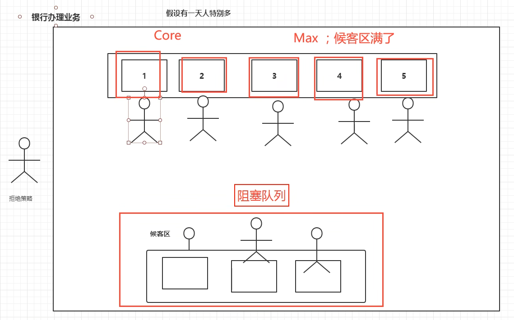

### 线程池

#### 好处：

1. 降低资源消耗
2. 提高相应速度
3. 方便管理

线程复用；可以控制最大并发数；管理线程。

#### 三大方法：


示例代码：

```java
package juc.concurrent.programming.threadpool;

import java.util.concurrent.ExecutorService;
import java.util.concurrent.Executors;

public class PoolDemo01 {

    public static void main(String[] args) {
        // 单个线程
        ExecutorService threadPool = Executors.newSingleThreadExecutor();
        // 创建一个固定大小的线程池
        Executors.newFixedThreadPool(5);
        // 可伸缩的。遇强则强，遇弱则弱。
        Executors.newCachedThreadPool();
        try {
            for (int i = 0; i < 10; i++) {
                // 使用线程池来创建线程，而不再是new Thread().start().
                threadPool.execute(() -> {
                    System.out.println(Thread.currentThread().getName() + " ready");
                });
            }
        } finally {
            // 关闭线程池
            threadPool.shutdown();
        }
    }
}
```

#### 七大参数

- int corePoolSize, // 核心线程池大小
- int maximumPoolSize, // 最大核心线程池大小
- long keepAliveTime, // 超时，没人调用就会释放
- TimeUnit unit, // 超时单位
- BlockingQueue<Runnable> workQueue, // 阻塞队列
- ThreadFactory threadFactory, // 线程工厂
- RejectedExecutionHandler handler // 拒绝策略

举例说明： 银行业务办理

1. 起初只有1-2号窗口开放 - 核心线程池大小
2. 超出的人在候客区等待 - 阻塞队列
3. 随着人数增多，3-5号窗口开始办理业务 - 最大核心线程池大小
4. 候客区也满了，临近下班时间，还有新的客户过来 - 拒绝策略
   

源码分析：

```java
public static ExecutorService newSingleThreadExecutor() {
    return new FinalizableDelegatedExecutorService
            (new ThreadPoolExecutor(1, 1,
                    0L, TimeUnit.MILLISECONDS,
                    new LinkedBlockingQueue<Runnable>()));
}

public static ExecutorService newFixedThreadPool(int nThreads) {
    return new ThreadPoolExecutor(nThreads, nThreads,
            0L, TimeUnit.MILLISECONDS,
            new LinkedBlockingQueue<Runnable>());
}

public static ExecutorService newCachedThreadPool() {
    return new ThreadPoolExecutor(0, Integer.MAX_VALUE,
            60L, TimeUnit.SECONDS,
            new SynchronousQueue<Runnable>());
}

// 由此可见，开启线程的本质是： ThreadPoolExecutor
```

```java
public ThreadPoolExecutor(
        int corePoolSize,     // 核心线程池大小
        int maximumPoolSize,  // 最大核心线程池大小
        long keepAliveTime,   // 超时，没人调用就会释放
        TimeUnit unit,        // 超时单位
        BlockingQueue<Runnable> workQueue,    // 阻塞队列
        ThreadFactory threadFactory,          // 线程工厂
        RejectedExecutionHandler handler      // 拒绝策略
) {
    if (corePoolSize < 0 ||
            maximumPoolSize <= 0 ||
            maximumPoolSize < corePoolSize ||
            keepAliveTime < 0)
        throw new IllegalArgumentException();
    if (workQueue == null || threadFactory == null || handler == null)
        throw new NullPointerException();
    this.corePoolSize = corePoolSize;
    this.maximumPoolSize = maximumPoolSize;
    this.workQueue = workQueue;
    this.keepAliveTime = unit.toNanos(keepAliveTime);
    this.threadFactory = threadFactory;
    this.handler = handler;
}
```

#### 四种拒绝策略


#### 自定义线程池

示例代码：

```java
package juc.concurrent.programming.threadpool;

import java.util.concurrent.*;

public class PoolDemo01 {

    public static void main(String[] args) {
        // 自定义线程池！工作中一定是自己创建 （阿里巴巴手册已经指出，Executors直接创建不安全）
        ExecutorService threadPool = new ThreadPoolExecutor(
                2,
                5,
                10,
                TimeUnit.SECONDS,
                new LinkedBlockingQueue<>(3),
                Executors.defaultThreadFactory(),
                // 银行满了还有人进来 - 不处理这个人的业务，抛出异常
                new ThreadPoolExecutor.AbortPolicy()
        );
        try {
            for (int i = 1; i <= 5; i++) {
                // 使用线程池来创建线程，而不再是new Thread().start().
                threadPool.execute(() -> {
                    System.out.println(Thread.currentThread().getName() + " ready");
                });
            }
        } finally {
            // 关闭线程池
            threadPool.shutdown();
        }
    }
}
```

执行结果：

```html
"D:\Program Files\Java\jdk-17.0.2\bin\java.exe" "-javaagent:D:\Program Files\JetBrains\IntelliJ IDEA Community Edition 2025.1\lib\idea_rt.jar=60473" -Dfile.encoding=UTF-8 -classpath F:\workspace\multiple-threads\target\classes;C:\Users\Administrator\.m2\repository\commons-io\commons-io\2.18.0\commons-io-2.18.0.jar;C:\Users\Administrator\.m2\repository\org\projectlombok\lombok\1.18.30\lombok-1.18.30.jar juc.concurrent.programming.threadpool.PoolDemo01
pool-1-thread-2 ready
pool-1-thread-2 ready
pool-1-thread-2 ready
pool-1-thread-2 ready
pool-1-thread-1 ready

Process finished with exit code 0

// 只开放两个窗口，最多只有两个线程工作！
```

##### 策略一： ThreadPoolExecutor.AbortPolicy() - 超出抛出异常

```java
public static void main(String[] args) {
    // 自定义线程池！工作中一定是自己创建 （阿里巴巴手册已经指出，Executors直接创建不安全）
    ExecutorService threadPool = new ThreadPoolExecutor(
            2,
            5,
            10,
            TimeUnit.SECONDS,
            new LinkedBlockingDeque<>(3),
            Executors.defaultThreadFactory(),
            // 银行满了还有人进来 - 不处理这个人的业务，抛出异常
            new ThreadPoolExecutor.AbortPolicy()
    );
    try {
        // 同时最大处理业务的量： maximumPoolSize(5) + LinkedBlockingDeque<>(3) = 8
        // 超出抛出异常：java.util.concurrent.RejectedExecutionException
        for (int i = 1; i <= 10; i++) {
            // 使用线程池来创建线程，而不再是new Thread().start().
            threadPool.execute(() -> {
                System.out.println(Thread.currentThread().getName() + " ready");
            });
        }
    } finally {
        // 关闭线程池
        threadPool.shutdown();
    }
}
```

##### 策略二： ThreadPoolExecutor.CallerRunsPolicy() - 谁送来谁负责处理！

示例代码：

```java
public static void main(String[] args) {
    // 自定义线程池！工作中一定是自己创建 （阿里巴巴手册已经指出，Executors直接创建不安全）
    ExecutorService threadPool = new ThreadPoolExecutor(
            2,
            5,
            10,
            TimeUnit.SECONDS,
            new LinkedBlockingDeque<>(3),
            Executors.defaultThreadFactory(),
            // 银行满了还有人进来 - 哪来的回那里去 （来自主线程则有主线程处理）
            new ThreadPoolExecutor.CallerRunsPolicy()
    );
    try {
        // 同时最大处理业务的量： maximumPoolSize(5) + LinkedBlockingDeque<>(3) = 8
        for (int i = 1; i <= 10; i++) {
            // 使用线程池来创建线程，而不再是new Thread().start().
            threadPool.execute(() -> {
                System.out.println(Thread.currentThread().getName() + " ready");
            });
        }
    } finally {
        // 关闭线程池
        threadPool.shutdown();
    }
}
```

执行结果：

```html
"D:\Program Files\Java\jdk-17.0.2\bin\java.exe" "-javaagent:D:\Program Files\JetBrains\IntelliJ IDEA Community Edition 2025.1\lib\idea_rt.jar=60930" -Dfile.encoding=UTF-8 -classpath F:\workspace\multiple-threads\target\classes;C:\Users\Administrator\.m2\repository\commons-io\commons-io\2.18.0\commons-io-2.18.0.jar;C:\Users\Administrator\.m2\repository\org\projectlombok\lombok\1.18.30\lombok-1.18.30.jar juc.concurrent.programming.threadpool.PoolDemo01
main ready
main ready
pool-1-thread-1 ready
pool-1-thread-1 ready
pool-1-thread-1 ready
pool-1-thread-1 ready
pool-1-thread-2 ready
pool-1-thread-3 ready
pool-1-thread-4 ready
pool-1-thread-5 ready

Process finished with exit code 0

// 可见，其中两个请求有main线程处理！
```

##### 策略三： ThreadPoolExecutor.DiscardPolicy() - 队列满了则丢点任务

示例代码：

```java
public static void main(String[] args) {
    // 自定义线程池！工作中一定是自己创建 （阿里巴巴手册已经指出，Executors直接创建不安全）
    ExecutorService threadPool = new ThreadPoolExecutor(
            2,
            5,
            10,
            TimeUnit.SECONDS,
            new LinkedBlockingDeque<>(3),
            Executors.defaultThreadFactory(),
            // 银行满了还有人进来 - 队列满了则丢点任务，不会抛出异常！
            new ThreadPoolExecutor.DiscardPolicy()
    );
    try {
        // 同时最大处理业务的量： maximumPoolSize(5) + LinkedBlockingDeque<>(3) = 8
        for (int i = 1; i <= 9; i++) {
            // 使用线程池来创建线程，而不再是new Thread().start().
            threadPool.execute(() -> {
                System.out.println(Thread.currentThread().getName() + " ready");
            });
        }
    } finally {
        // 关闭线程池
        threadPool.shutdown();
    }
}
```

执行结果：

```html
"D:\Program Files\Java\jdk-17.0.2\bin\java.exe" "-javaagent:D:\Program Files\JetBrains\IntelliJ IDEA Community Edition 2025.1\lib\idea_rt.jar=61113" -Dfile.encoding=UTF-8 -classpath F:\workspace\multiple-threads\target\classes;C:\Users\Administrator\.m2\repository\commons-io\commons-io\2.18.0\commons-io-2.18.0.jar;C:\Users\Administrator\.m2\repository\org\projectlombok\lombok\1.18.30\lombok-1.18.30.jar juc.concurrent.programming.threadpool.PoolDemo01
pool-1-thread-3 ready
pool-1-thread-2 ready
pool-1-thread-3 ready
pool-1-thread-3 ready
pool-1-thread-4 ready
pool-1-thread-1 ready
pool-1-thread-2 ready
pool-1-thread-5 ready

Process finished with exit code 0

// 可见，第9个任务没有处理，而是直接丢弃！
```

##### 策略四： ThreadPoolExecutor.DiscardOldestPolicy() - 队列满了则尝试和最早的竞争（成功则被执行，失败会被丢弃），不抛出异常

示例代码：

```java
public static void main(String[] args) {
    // 自定义线程池！工作中一定是自己创建 （阿里巴巴手册已经指出，Executors直接创建不安全）
    ExecutorService threadPool = new ThreadPoolExecutor(
            2,
            5,
            10,
            TimeUnit.SECONDS,
            new LinkedBlockingDeque<>(3),
            Executors.defaultThreadFactory(),
            // 银行满了还有人进来 - 队列满了则尝试和最早的竞争（成功则被执行，失败会被丢弃），不抛出异常
            new ThreadPoolExecutor.DiscardOldestPolicy()
    );
    try {
        // 同时最大处理业务的量： maximumPoolSize(5) + LinkedBlockingDeque<>(3) = 8
        for (int i = 1; i <= 9; i++) {
            // 使用线程池来创建线程，而不再是new Thread().start().
            threadPool.execute(() -> {
                System.out.println(Thread.currentThread().getName() + " ready");
            });
        }
    } finally {
        // 关闭线程池
        threadPool.shutdown();
    }
}
```

### 小节和拓展

问题： 最大线程该怎么定义
1. CPU密集型
2. IO密集型