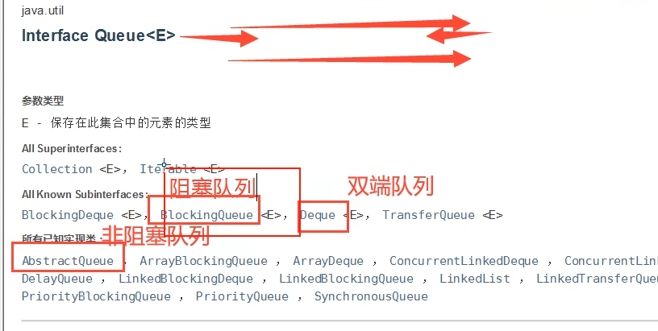
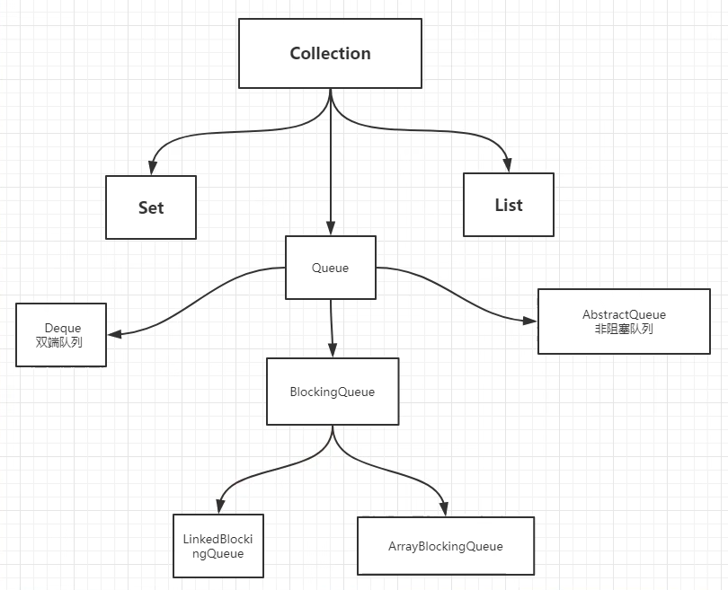
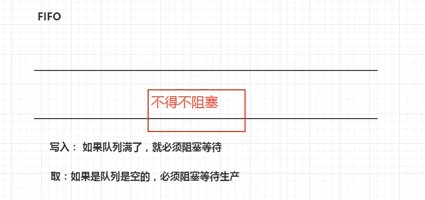
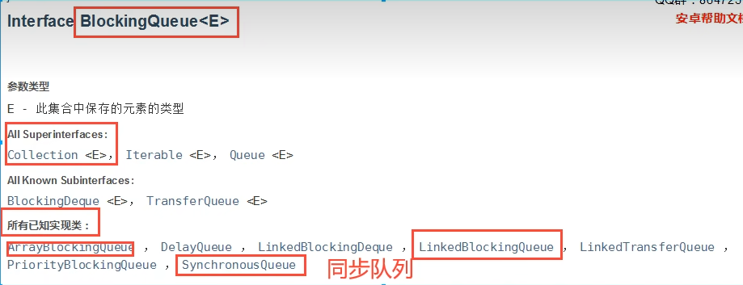
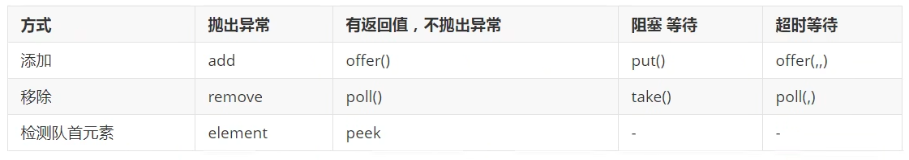

# 队列



Collection tree view:



### 阻塞队列

#### 使用场景：

- 多线程并发处理
- 线程池



阻塞队列:


#### 使用队列 <添加> <移除>

API:


##### 第一组：抛出异常

示例代码：

```java
/**
 * 抛出异常解决方案：
 * queue.add(1)
 * queue.remove()
 * queue.element()
 */
public static void queueThrowExceptionDemo() {
    BlockingQueue<Integer> queue = new ArrayBlockingQueue<>(3);
    System.out.println(queue.add(1));
    System.out.println(queue.add(2));
    System.out.println(queue.add(3));
    // Exception in thread "main" java.lang.IllegalStateException: Queue full
    // System.out.println(queue.add(4));
    System.out.println(queue.remove());
    System.out.println(queue.remove());
    System.out.println(queue.remove());
    // 查看队首元素
    System.out.println(queue.element());
    // Exception in thread "main" java.util.NoSuchElementException
    // System.out.println(queue.remove());
}
```

##### 第二组： 有返回值 (不抛异常)

示例代码：

```java
/**
 * 有返回值，不抛异常
 * queue.offer(i)
 * queue.poll()
 * queue.peek()
 */
public static void queueReturnValue() {
    BlockingQueue<Integer> queue = new ArrayBlockingQueue<>(3);
    for (int i = 0; i < 4; i++) {
        // Return `false` when i == 3
        System.out.println(queue.offer(i));
    }

    for (int i = 0; i < 4; i++) {
        // Return `null` when i == 3
        System.out.println(queue.poll());
        // 查看队首元素
        System.out.println(queue.peek());
    }
}
```

- 执行结果：

```html
"D:\Program Files\Java\jdk-17.0.2\bin\java.exe" "-javaagent:D:\Program Files\JetBrains\IntelliJ IDEA Community Edition 2025.1\lib\idea_rt.jar=51502" -Dfile.encoding=UTF-8 -classpath F:\workspace\multiple-threads\target\classes;C:\Users\Administrator\.m2\repository\commons-io\commons-io\2.18.0\commons-io-2.18.0.jar;C:\Users\Administrator\.m2\repository\org\projectlombok\lombok\1.18.30\lombok-1.18.30.jar juc.concurrent.programming.queue.BlockQueueDemo
true
true
true
false
0
1
2
null

Process finished with exit code 0
```

##### 第三组： 阻塞 等待

示例代码：

```java
/**
 * 等待，阻塞 （一直阻塞）
 * queue.put(1)
 * queue.take()
 */
public static void queueWaitBlock() throws InterruptedException {
    BlockingQueue<Object> queue = new ArrayBlockingQueue<>(3);
    queue.put(1);
    queue.put(2);
    queue.put(3);
    // 队列已满， 一直阻塞
    queue.put(4);
    System.out.println(queue.take());
    System.out.println(queue.take());
    System.out.println(queue.take());
    // 队列已空，一直阻塞
    System.out.println(queue.take());
}
```

##### 第四组： 超时 等待

示例代码：

```java
/**
 * 等待，超时退出
 * queue.offer(1, 3, TimeUnit.SECONDS)
 * queue.poll(3, TimeUnit.SECONDS);
 *
 * @throws InterruptedException
 */
public static void queueWaitTimeout() throws InterruptedException {
    BlockingQueue<Object> queue = new ArrayBlockingQueue<>(3);
    queue.offer(1, 3, TimeUnit.SECONDS);
    queue.offer(2, 3, TimeUnit.SECONDS);
    queue.offer(3, 3, TimeUnit.SECONDS);
    // 等待超过3秒，退出程序
    queue.offer(4, 3, TimeUnit.SECONDS);

    queue.poll();
    queue.poll();
    queue.poll();
    // 等待超过3秒，退出程序
    queue.poll(3, TimeUnit.SECONDS);
}
```

#### 同步队列 SynchronousQueue

没有容量， 进去一个元素，必须等待取出来之后，才能在往里面放一个元素。
示例代码：

```java
package juc.concurrent.programming.queue;

import java.util.concurrent.BlockingQueue;
import java.util.concurrent.SynchronousQueue;
import java.util.concurrent.TimeUnit;

public class SynchronousQueueDemo {
    public static void main(String[] args) {
        BlockingQueue<String> synchronousQueue = new SynchronousQueue<>();
        new Thread(() -> {
            try {
                System.out.println(Thread.currentThread().getName() + " put 1");
                synchronousQueue.put("1");
                System.out.println(Thread.currentThread().getName() + " put 2");
                synchronousQueue.put("2");
                System.out.println(Thread.currentThread().getName() + " put 3");
                synchronousQueue.put("3");
            } catch (InterruptedException e) {
                throw new RuntimeException(e);
            }
        }, "线程1").start();
        new Thread(() -> {
            try {
                TimeUnit.SECONDS.sleep(1);
                System.out.println(Thread.currentThread().getName() + " take " + synchronousQueue.take());
                TimeUnit.SECONDS.sleep(1);
                System.out.println(Thread.currentThread().getName() + " take " + synchronousQueue.take());
                TimeUnit.SECONDS.sleep(1);
                System.out.println(Thread.currentThread().getName() + " take " + synchronousQueue.take());
            } catch (InterruptedException e) {
                throw new RuntimeException(e);
            }
        }, "线程2").start();
    }
}
```

执行结果 (结果不符，待调试)：

```html
"D:\Program Files\Java\jdk-17.0.2\bin\java.exe" "-javaagent:D:\Program Files\JetBrains\IntelliJ IDEA Community Edition 2025.1\lib\idea_rt.jar=53213" -Dfile.encoding=UTF-8 -classpath F:\workspace\multiple-threads\target\classes;C:\Users\Administrator\.m2\repository\commons-io\commons-io\2.18.0\commons-io-2.18.0.jar;C:\Users\Administrator\.m2\repository\org\projectlombok\lombok\1.18.30\lombok-1.18.30.jar juc.concurrent.programming.queue.SynchronousQueueDemo
线程1 put 1
线程1 put 2
线程2 take 1
线程1 put 3
线程2 take 2
线程2 take 3

Process finished with exit code 0

```